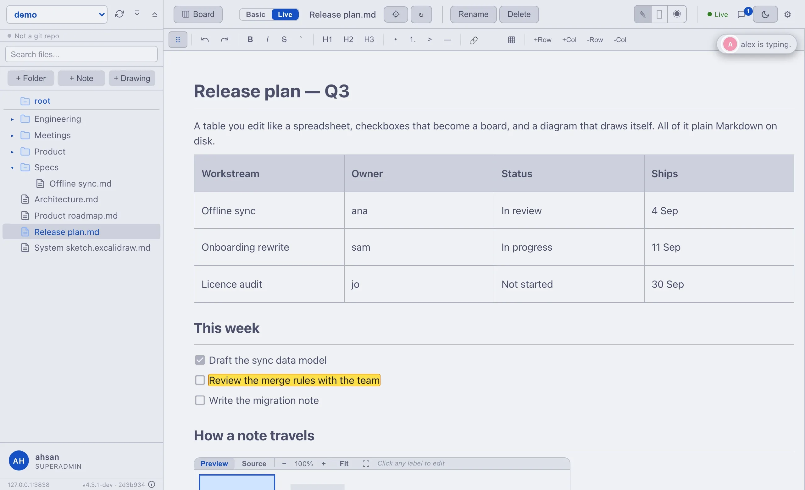
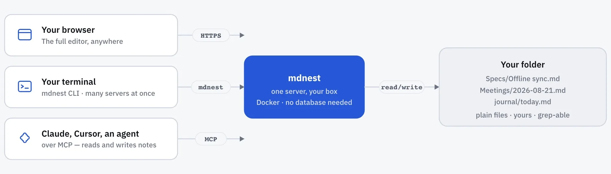
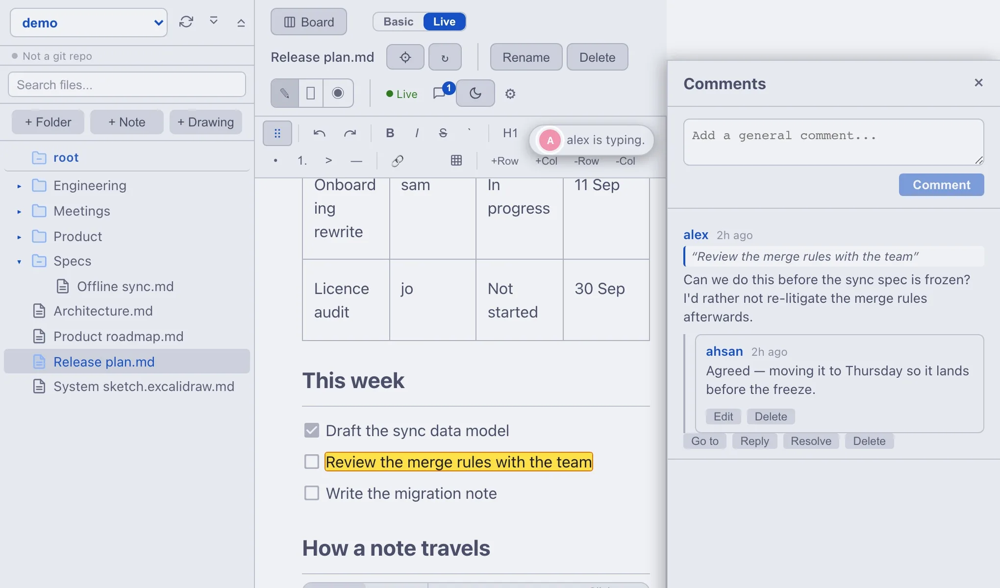
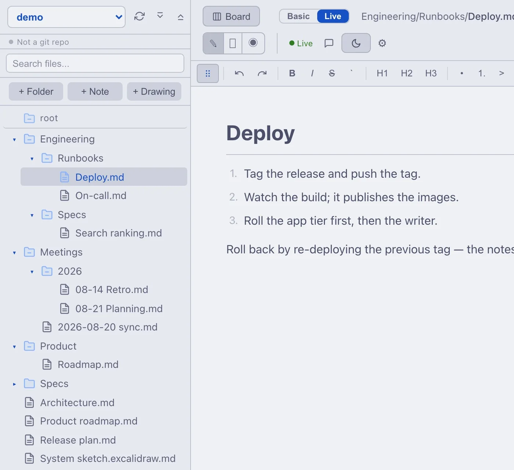
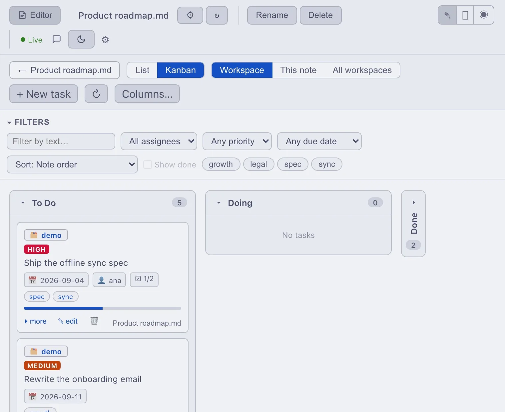

# mdnest

**Your notes. On your server. Open in a browser, a terminal, or Claude.**

mdnest is a notes app you run yourself. Every note is an ordinary Markdown file
in a folder you chose — so you can open it in mdnest, `grep` it from a terminal,
or let an AI agent read and edit it, and it is always the same file.

No cloud account. No database to feed. Nothing leaves your machine.

<picture>
  <source media="(prefers-color-scheme: dark)" srcset="docs/images/dark-app.webp">
  
</picture>

### Three ways in, one set of files

<picture>
  <source media="(prefers-color-scheme: dark)" srcset="docs/images/interfaces-dark.webp">
  
</picture>

Most people find mdnest as a web app and never learn the rest. The **CLI** talks
to *several servers at once* — `mdnest read @work/engineering/spec.md` and
`mdnest append @home/journal/today.md "..."` from the same shell. The **MCP
server** gives Claude or Cursor the same read and write access, so an agent has
a memory that survives the session.

### What you get

- 📝 **A real editor.** Markdown turns into rich text as you type — tables you
  edit like a spreadsheet, diagrams from a code fence, math, drag-and-drop
  images. Or flip to plain text whenever you want.
- 🗂️ **Folders, not one big pile.** Nest them as deep as you like, and keep
  separate workspaces for work, home and side projects.
- 👥 **Two people, one note.** See who else is in it, watch them type, and leave
  comment threads anchored to the exact sentence.
- 🤖 **Built for agents.** MCP and a CLI, both reading and writing the same
  files you do.
- ⚡ **Quick, because there is nothing in the way.** No import, no index to
  rebuild. Search results and the task board are kept in memory.
- 🛟 **Backs itself up.** Point a workspace at a git repo and mdnest commits and
  pushes it on a schedule. Browse any note's history and restore a version from
  inside the app.
- 🚪 **No lock-in.** They are `.md` files. Walk away and take the folder.

### Is it for you?

- **You run AI agents** and want them to remember things between runs.
- **You use more than one device** and want one set of notes on all of them.
- **You are a small team** that wants a shared wiki without the Confluence bill.

> Just want a local vault on one Mac? [Obsidian](https://obsidian.md) is great.
> Pick mdnest when you want your notes on every device, backed up, and open to
> your AI.

<sub>Handles 1,000–5,000 notes out of the box. Bigger? Tune the [search settings](#search) — config only. Full feature list in [More features](#more-features).</sub>

## Prerequisites

- [Docker](https://docs.docker.com/get-docker/) and [Docker Compose](https://docs.docker.com/compose/install/)
- Git
- *Optional:* [Tailscale](https://tailscale.com/download) — free, **only** if you want encrypted remote access to your own devices later. Not needed to install or run mdnest.

## Quick Start

### 1. Set up the server

```bash
git clone https://github.com/mahsanamin/mdnest.git
cd mdnest
./mdnest-server setup
```

This creates `mdnest.conf` from the sample. Open it and set:

1. **Credentials** -- change `MDNEST_USER`, `MDNEST_PASSWORD`, and `MDNEST_JWT_SECRET`
2. **Mounts** -- add at least one `MOUNT_<name>=<path>` pointing to a directory on your machine

Example:
```
MDNEST_USER=ahsan
MDNEST_PASSWORD=mysecurepassword
MDNEST_JWT_SECRET=some-random-string

MOUNT_personal=/home/ahsan/notes
MOUNT_work=/home/ahsan/work-notes
```

Then build and start:

```bash
./mdnest-server rebuild
```

Open [http://localhost:3236](http://localhost:3236)

### 2. Enable remote access

Install Tailscale on the host and on your phone/laptop, then:

```bash
tailscale serve --bg --https 3236 http://127.0.0.1:3236
```

Access from any of your devices: `https://your-server.tailnet.ts.net:3236`

Encrypted, private, no ports opened to the internet. See [Remote Access](#remote-access) for more options.

## Accessing Your Notes

Once the server is running, there are three ways to access your notes:

### Web UI (browser)

Open `http://localhost:3236` (or your Tailscale URL) in any browser. Works on desktop and mobile.

### CLI (terminal)

Install it on any machine (macOS / Linux):

```bash
curl -fsSL https://raw.githubusercontent.com/mahsanamin/mdnest/main/install-cli.sh | bash
```

Create a token in the web UI (Settings → API Tokens), then name your server
whatever you like. **One machine can hold as many servers as you want** — that
is the part most people miss:

```bash
mdnest login @work https://notes.company.com:3236 mdnest_abc123
mdnest login @home https://mdnest.lan:3236        mdnest_def456
mdnest servers -v          # every server, and the namespaces on each
```

Paths read `@alias/namespace/path/to/file.md`, so one shell reaches all of them:

```bash
mdnest read   @work/engineering/Specs/Offline\ sync.md
mdnest search @work/engineering "offline sync"
mdnest append @home/journal/today.md "- [ ] send the recap"
mdnest list   @home/journal                    # a tree, not raw JSON
mdnest create @home/ideas/new.md "First line"  # create = new file
mdnest write  @home/ideas/new.md "Replaced"    # write = must already exist
mdnest edit   @home/log.md "draft" "final"     # edit = one exact string
echo "piped" | mdnest append @home/log.md -    # stdin with -
```

`edit` is the one to reach for from a script or an agent: it changes only the
text you name, and it refuses the write if the note changed since it read it,
so a save from the web UI or another client is never silently overwritten.

Drop the `@alias` if you only configured one server. `mdnest --help` lists
everything; `mdnest docs` prints the full reference.

### MCP Server (AI agents)

AI agents can read, write, search, and organize your notes via the bundled MCP server.

```bash
cd mcp-server && npm install
```

Create an API token in Settings (gear icon) > API Tokens, then configure your MCP client:

```json
{
  "mcpServers": {
    "mdnest": {
      "command": "node",
      "args": ["/path/to/mdnest/mcp-server/index.js"],
      "env": {
        "MDNEST_URL": "http://localhost:8286",
        "MDNEST_TOKEN": "<your API token>"
      }
    }
  }
}
```

**Available tools:** `list_namespaces`, `list_tree`, `read_note`, `write_note`, `edit_note`, `append_note`, `prepend_note`, `create_note`, `create_folder`, `delete_item`, `move_item`, `search_notes`

For a **shared/hosted endpoint** the server also speaks the streamable-HTTP
transport (`MCP_TRANSPORT=http`, `POST /mcp`), with an optional per-user OAuth
2.1 mode and an opt-in Docker Compose service. See
[docs/mcp.md](docs/mcp.md) for transports, auth modes, and deployment.

## Server Management

All server commands use `mdnest-server` and must be run from the project directory:

```bash
./mdnest-server start              # start all services
./mdnest-server stop               # stop all services
./mdnest-server restart            # restart all services
./mdnest-server rebuild            # rebuild after code or config changes
./mdnest-server logs               # view logs (all services)
./mdnest-server logs backend       # view backend logs only
./mdnest-server sync-logs          # view git-sync logs
./mdnest-server status             # show running containers
./mdnest-server migrate            # run database migrations (multi mode only)
```

After editing `mdnest.conf`, always re-run:
```bash
./mdnest-server rebuild
```

## Updating

```bash
./mdnest-server update
```

## Configuration

Everything is driven by `mdnest.conf`. Run `./mdnest-server rebuild` after any change.

| Setting | Description | Default |
|---|---|---|
| `MDNEST_USER` | Login username (single mode) / initial admin (multi mode) | `admin` |
| `MDNEST_PASSWORD` | Login password (single mode) / initial admin password (multi mode) | `changeme` |
| `MDNEST_JWT_SECRET` | JWT signing secret | `changeme` |
| `BACKEND_PORT` | Backend API port | `8286` |
| `FRONTEND_PORT` | Frontend UI port | `3236` |
| `BIND_ADDRESS` | Host IP(s) to bind to. Comma-separated for multi-IP (e.g. `127.0.0.1,100.73.118.115`) — useful for localhost + a Tailscale / VPN address without `0.0.0.0`. | `127.0.0.1` |
| `MOUNT_<name>` | Map a host directory as a namespace | -- |
| `AUTH_MODE` | `single` (file-based, no DB) or `multi` (Postgres-backed users & permissions) | `single` |
| `POSTGRES_PASSWORD` | PostgreSQL password (required when `AUTH_MODE=multi`) | -- |

### Search

Filename filtering is instant (client-side). Content search runs server-side with concurrent file reads, a cached file index, and early termination.

| Setting | Description | Default |
|---|---|---|
| `SEARCH_MAX_RESULTS` | Max results per query | `30` |
| `SEARCH_MAX_FILE_SIZE` | Skip files larger than this (bytes) | `1048576` (1 MB) |
| `SEARCH_WORKERS` | Parallel file readers | `8` |
| `SEARCH_CACHE_TTL` | File list cache lifetime (seconds) | `30` |

For 10,000+ notes: set `SEARCH_WORKERS=16` and `SEARCH_CACHE_TTL=60`.

## Multi-User Mode

By default, mdnest runs in **single-user mode** — one user, file-based auth, no database. Ideal for personal use.

**Multi-user mode** adds a three-tier role hierarchy, per-namespace grants, optional 2FA, and your choice of three identity providers (corporate SSO, Firebase Auth, or local username/password). Set `AUTH_MODE=multi` in `mdnest.conf` and `setup.sh` adds a Postgres container automatically.

It also turns on the parts that need more than one person. Open a note someone
else has open and you can see them there, watch them type, and argue about a
sentence in a thread pinned to that sentence:

<picture>
  <source media="(prefers-color-scheme: dark)" srcset="docs/images/dark-collab.webp">
  
</picture>

```ini
AUTH_MODE=multi
POSTGRES_PASSWORD=a-secure-password

# Pick an identity provider:
USER_PROVIDER=local         # username/password + per-user TOTP (default)
# or
USER_PROVIDER=sso           # corporate OIDC — see docs/sso-setup.md
# or
USER_PROVIDER=firebase      # Firebase Auth + Firestore TOTP — see docs/firebase-setup.md
```

Then rebuild:

```bash
./mdnest-server rebuild
```

### Roles

- **SuperAdmin** — global. Manages everyone, every namespace, every grant. Promote with `ADMIN_EMAILS=ops@example.com` in `mdnest.conf` (auto-promoted on every startup).
- **Admin** — namespace-scoped. Manages users, grants, and git-sync for just the namespaces in their `namespace_admins` rows. Cannot reset 2FA or change global roles.
- **Collaborator** — per-grant access only. Sees only the namespaces / paths assigned to them.

Assign namespace admins via the admin panel's **Namespace Admins** tab, or `POST /api/admin/namespace-admins`. See [docs/security.md](docs/security.md) for the full authorization model and [docs/api.md](docs/api.md) for the API.

### Recommended team install — corporate SSO

For a small company deploying mdnest as a shared knowledge base:

```ini
AUTH_MODE=multi
USER_PROVIDER=sso
SSO_ISSUER_URL=https://accounts.google.com    # or your IdP
SSO_CLIENT_ID=...
SSO_CLIENT_SECRET=...
SSO_ALLOWED_DOMAINS=example.com               # optional but recommended
ADMIN_EMAILS=ops@example.com,you@example.com  # auto-promoted to superadmin
POSTGRES_PASSWORD=a-secure-password
```

Plus a TLS reverse proxy ([Caddy](docs/setup.md#option-1-caddy-built-in-simplest), [nginx + certbot](docs/setup.md#option-3-nginx-reverse-proxy--certbot), or [Cloudflare Tunnel](docs/setup.md#option-4-cloudflare-tunnel)) so the backend stays loopback-only and only the proxy is exposed.

**Upgrading an existing single-user instance to multi-user:**

1. Edit `mdnest.conf`: add `AUTH_MODE=multi`, `POSTGRES_PASSWORD=<secure>`, and your `USER_PROVIDER` settings.
2. `./mdnest-server rebuild` — regenerates docker-compose.yml with a Postgres service, runs migrations on first start, seeds the initial admin.

Existing notes on disk are untouched. The database stores only user accounts and access grants.

See [docs/setup.md](docs/setup.md) for the full multi-user walkthrough, [docs/sso-setup.md](docs/sso-setup.md) for IdP-specific (Google / Okta / Entra / Keycloak / Auth0) instructions, and [docs/firebase-setup.md](docs/firebase-setup.md) for the Firebase peer-mode setup.

## Namespaces

Each `MOUNT_<name>=<host_path>` entry in `mdnest.conf` mounts a host directory as a namespace. Namespaces are isolated -- separate trees, separate files. Add or remove by editing `mdnest.conf` and running `./mdnest-server rebuild`.

Inside one, nest folders as deep as you like. What you see in the sidebar is
exactly what is on disk:

<picture>
  <source media="(prefers-color-scheme: dark)" srcset="docs/images/dark-tree.webp">
  
</picture>

## Git Sync (Optional)

**If a namespace is a git repo, mdnest keeps it committed and pushed for you.**
You write; it saves the history. That gives you an off-box backup, a full
version history for every note, and a restore button inside the app — and the
backup is an ordinary git repo you can clone, `grep` and read without mdnest.

Your notes are private by default. Nothing leaves your machine unless you choose to enable sync.

To back up to a private GitHub repo:

1. Initialize each namespace directory as a git repo with a remote
2. Add an SSH key (passphrase-protected keys won't work inside Docker):
   ```bash
   mkdir -p git-sync/keys
   # Option A: single key for all repos
   ssh-keygen -t ed25519 -f git-sync/keys/default -N "" -C "mdnest-sync"
   # Option B: one key per namespace (required for GitHub deploy keys)
   ssh-keygen -t ed25519 -f git-sync/keys/<namespace> -N "" -C "mdnest-sync"
   ```
3. Add the `.pub` key to your Git provider (GitHub: Settings > Deploy Keys, enable write access)
4. Rebuild:
   ```bash
   ./mdnest-server rebuild
   ```

Git sync starts automatically when keys are found in `git-sync/keys/`. No keys = no sync.

The sync interval is configurable (default: every 10 minutes):

```
GIT_SYNC_INTERVAL=900    # sync every 15 minutes
```

The git remote is a **backup destination** — let mdnest be the only thing pushing to it. Don't commit to the same repo from other tools. See [docs/setup.md](docs/setup.md) for full setup details.

## Remote Access

All ports bind to `127.0.0.1` by default. To access from other devices:

### Tailscale (recommended)

Tailscale creates an encrypted private network between your devices. No ports opened, no public IP needed.

**Option A: Dedicated port (multiple services on the host)**

```bash
tailscale serve --bg --https 3236 http://127.0.0.1:3236
```

Access: `https://<your-hostname>.tailnet-name.ts.net:3236`

**Option B: Default HTTPS (host dedicated to mdnest)**

```bash
tailscale serve --bg http://127.0.0.1:3236
```

Access: `https://<your-hostname>.tailnet-name.ts.net`

**Manage:**

```bash
tailscale serve status    # see active rules
tailscale serve off       # remove all rules
```

### Other options

- **Nginx + Certbot** -- traditional reverse proxy with free TLS. See [docs/setup.md](docs/setup.md).
- **Cloudflare Tunnel** -- no open ports, works behind NAT. See [docs/setup.md](docs/setup.md).

## More features

Beyond the core editor and the three access interfaces, mdnest includes:

- **Obsidian `[[wikilinks]]`.** Bring an Obsidian vault over as-is: `[[note]]`, `[[note|alias]]`, `[[note#heading]]`, and `[[#heading]]` resolve against your notes and open in-app — in both the preview and the Live editor. Broken links show muted so you can spot missing notes, and the markdown on disk stays literal `[[...]]`.
- **Inline comments with threads.** Highlight any text and leave a comment; commented passages stay highlighted in yellow, and reviewers reply in a thread. Click a highlight to jump to the conversation. Comments are anchored to invisible UUIDs, so moving or renaming files keeps them attached.
- **Live collaboration.** Multiple people editing the same note see each other's cursors and changes in real time over WebSocket. Toggle with `ENABLE_LIVE_COLLAB=true`.
- **Task board from your notes.** Every `- [ ]` checkbox becomes a card on a per-namespace kanban board — with due dates, priorities, tags, sub-steps and descriptions written as an indented block in the note itself. Drag between columns, create and edit whole tasks from the board, scope it to one note or the whole workspace — and it's still just markdown on disk. Enable with `ENABLE_TASK_BOARD=true`. See [docs/tasks.md](docs/tasks.md).

  <picture>
    <source media="(prefers-color-scheme: dark)" srcset="docs/images/dark-board.webp">
    
  </picture>

- **Excalidraw drawings.** Open a `.excalidraw.md` note on a full Excalidraw canvas, or embed a drawing read-only inside any note. Obsidian-compatible on disk (the scene is a JSON block, the text is mirrored so it stays searchable), so it reuses the same history, restore, comments and search as any note. Opt-in with `ENABLE_EXCALIDRAW=true`; operators can preload shared shape libraries. See [docs/excalidraw.md](docs/excalidraw.md).
- **Interactive mermaid diagrams.** Diagrams render in-place with a Source/Preview/zoom toolbar and click-to-edit labels — edit node text directly on the diagram without touching the code.
- **In-app version history.** With git-sync enabled, right-click any note → **History** to browse past versions, compare any two as a diff, and one-click restore. Restoration is itself versioned and undoable through the same modal.
- **Namespace-scoped admins.** One or two SuperAdmins overall, plus per-team Admins who manage just their own namespace — invite users, manage grants, trigger git-sync — without touching other teams' data. See [docs/security.md](docs/security.md#layer-3--authorization).
- **Corporate SSO + 2FA.** Point mdnest at any OIDC provider (Google Workspace, Okta, Microsoft Entra, Keycloak, Auth0); the IdP owns MFA, mdnest owns per-namespace authorization. Or use local username/password with TOTP. One `USER_PROVIDER` flag — no code changes. See [docs/sso-setup.md](docs/sso-setup.md).
- **API-first.** Full REST API + CLI with multi-server support (`mdnest read @work/eng/spec.md`). Build scripts, automations, or integrations on top of your notes.
- **Bring your own repo, per workspace.** In multi-user mode each namespace — including a user's personal one — can mirror to its *own* git repository instead of one operator-wide remote, so a team (or a person) owns the durability of their own notes. Credentials are sealed at rest and never leave the server. See [docs/security.md](docs/security.md).
- **Scale out without shared storage.** An optional `git` storage backend owns git history in-process, and with Redis it runs as several stateless replicas behind one durability writer — no ReadWriteMany volume required. Git stays the source of truth. Read the durability trade-off in [docs/kubernetes.md](docs/kubernetes.md) before choosing it.
- **Git backup on your terms.** Optional sidecar auto-commits and pushes to a private repo on a schedule you control. See [Git Sync](#git-sync-optional).
- **Update-aware.** The backend polls GitHub for newer releases; when one drops, a badge in the sidebar footer surfaces the release notes inline. Opt out with `DISABLE_UPDATE_CHECK=true` for air-gapped installs.

## Documentation

- [docs/setup.md](docs/setup.md) — Setup, configuration, env vars
- [docs/user-guide.md](docs/user-guide.md) — End-user walkthrough
- [docs/tasks.md](docs/tasks.md) — Task model: how notes become a kanban task board
- [docs/security.md](docs/security.md) — Threat model, identity, authorization, role hierarchy
- [docs/architecture.md](docs/architecture.md) — Backend / frontend / database layout
- [docs/api.md](docs/api.md) — Full REST API reference with curl examples
- [docs/cli.md](docs/cli.md) — `mdnest` CLI for terminal access (multi-server)
- [docs/kubernetes.md](docs/kubernetes.md) — Optional Helm chart, if you'd rather run it in a cluster
- [docs/mcp.md](docs/mcp.md) — MCP server for AI agents (stdio + streamable-HTTP, OAuth, Compose)
- [docs/sso-setup.md](docs/sso-setup.md) — Corporate SSO (Google / Okta / Entra / Keycloak / Auth0)
- [docs/firebase-setup.md](docs/firebase-setup.md) — Firebase Auth peer mode

## License

MIT. See [LICENSE](LICENSE).
