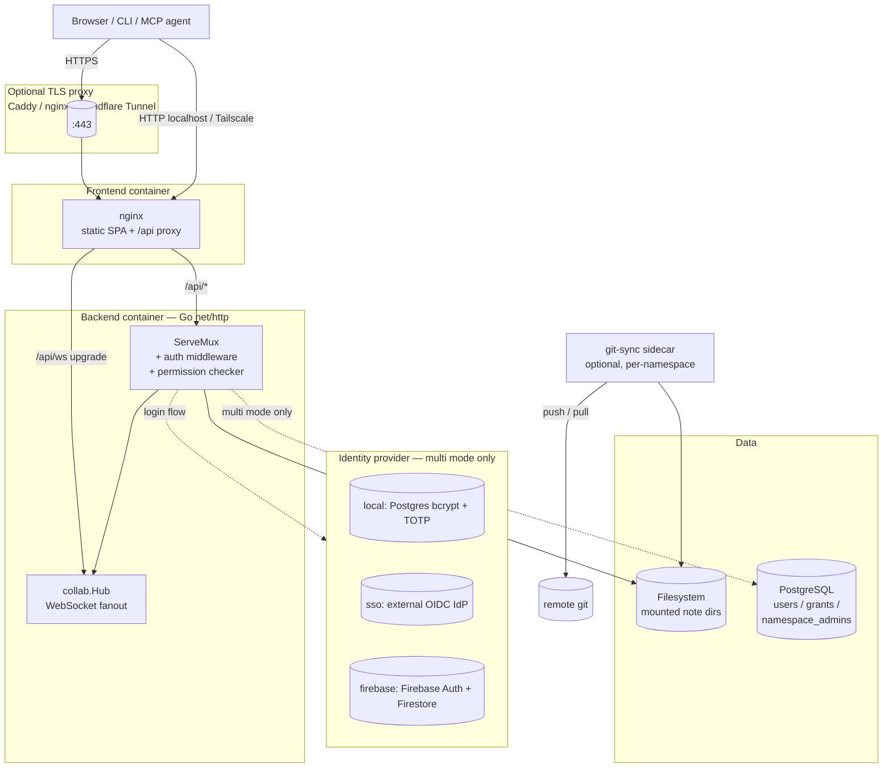
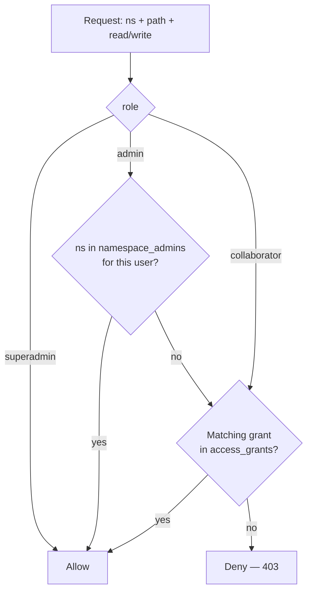

# Architecture Overview

This document describes how mdnest is structured, how its components interact, and the design decisions behind the system.

---

## High-Level Architecture



**The pieces:**

- **Frontend** is a single-page React app bundled by Vite, served as static files by Nginx. Nginx also proxies `/api/*` to the backend (and upgrades `/api/ws` to a WebSocket).
- **Backend** is a single Go binary using only `net/http` from the standard library. All routes are registered on a `ServeMux` in `main.go` and wrapped with an auth middleware + (in multi mode) a `PermissionChecker` that consults the role/grant model.
- **Identity** in multi-mode is provided by one of three exclusive plugins: `local` (username + password + Postgres-backed TOTP), `sso` (generic OIDC relying party), or `firebase` (Firebase Auth + Firestore TOTP). Pick one with `USER_PROVIDER=` in `mdnest.conf`. Single-mode skips this layer entirely.
- **PostgreSQL** is added by `setup.sh` automatically when `AUTH_MODE=multi`. It stores user accounts, access grants, and (v3.5.0+) namespace-admin assignments. **Note content is never in the database** — files on disk are the source of truth in every mode.
- **Live collaboration** uses an in-process `collab.Hub` that fans WebSocket events between connected clients (presence, cursors, tree-changed events, comment broadcasts). Gated on `ENABLE_LIVE_COLLAB=true` in multi mode. For active/active (multiple backend replicas), set `REDIS_URL` — the Hub then fans events across replicas over a Redis backplane instead of only within one process, so presence and edits stay consistent cluster-wide.
- **git-sync** is an optional sidecar that commits + pulls + pushes each namespace on a timer. Auto-enabled when SSH keys are present in `git-sync/keys/`.

---

## Repository Structure

```
mdnest/
  backend/
    main.go                    # Entry point. Reads conf, picks identity provider,
                               # builds handlers + middleware, registers routes.
    Dockerfile                 # Multi-stage build: golang:1.26-alpine → alpine:latest.
                               # BuildKit cache mounts persist Go module + build caches.
    handlers/
      auth.go                  # POST /api/auth/login, POST /api/auth/change-password.
      tokens.go                # API token CRUD + validation. Tokens resolve to
                               # creator's UserContext at request time (v3.5.0+:
                               # no system-wide admin bypass).
      totp.go                  # TOTP setup / verify / disable. Multi-mode + non-SSO only.
      sso.go                   # GET /api/auth/sso/start + /callback. Generic OIDC relying
                               # party (USER_PROVIDER=sso only).
      dev_login.go             # POST /api/auth/dev-login — INSECURE_DEV_LOGIN backdoor.
                               # Only registered when the env flag is set.
      namespaces.go            # GET /api/namespaces — filtered through PermissionChecker.
      tree.go                  # GET /api/tree — recursive directory listing.
      notes.go                 # GET/POST/PUT/PATCH/DELETE /api/note — CRUD + append/prepend.
      noteid.go                # ExtractNoteID/InjectNoteID/EnsureNoteID — invisible UUID
                               # marker that anchors comments across renames + moves.
      comments.go              # GET/POST/PATCH/DELETE /api/comments — multi-mode + collab.
      search.go                # GET /api/search — concurrent content search with caching.
      upload.go                # POST /api/upload, POST /api/folder, GET /api/files/*.
      move.go                  # POST /api/move — rename + move within a namespace.
      sync.go                  # POST /api/admin/sync — per-namespace git pull/push.
                               # Scoped to caller's admin namespaces in multi mode.
      admin.go                 # User management + grants + namespace-admin assignments.
                               # Three-tier role hierarchy: superadmin / admin / collaborator.
      me.go                    # GET /api/me — current user + grants (incl. group-inherited,
                               # v4.2.0+) + admin scope.
      groups.go                # /api/admin/groups(/members|/grants) — role-based access
                               # Groups (v4.2.0+). Superadmin-only, multi mode only.
      tasks.go                 # /api/tasks, /api/tasks/all, /api/board — task board request
                               # handling. Behind ENABLE_TASK_BOARD.
      tasks_markdown.go        # Pure markdown helpers for tasks: parse a task line and its
                               # detail block, resolve columns, render a spec back to
                               # markdown, generate stable refs. Split out of tasks.go so the
                               # handler file stays request handling (v4.2.0+).
      team.go                  # GET /api/namespace/users — namespace members, for the
                               # assignee picker (v4.2.0+).
      attribution.go           # GET /api/note/attribution — created / last-edited /
                               # contributors (v4.2.0+). Not registered without a DB.
      marp_themes.go           # GET/PUT/DELETE /api/marp/themes — centralized theme catalog
                               # in the reserved .marp-themes namespace (v4.2.0+).
      config.go                # GET /api/config — unauthenticated. Tells the frontend
                               # which mode + provider + flags are live.
      ws.go                    # /api/ws WebSocket handler for live collab. Verifies JWT.
      path.go                  # SafePath() + RequireNamespace() — path traversal defense.
    middleware/
      auth.go                  # JWT + API token validation.
      context.go               # UserContext + IsAdmin / IsSuperAdmin helpers.
      cors.go                  # CORS header middleware.
      admin.go                 # RequireAdmin (any admin role) + RequireSuperAdmin gates.
      permission.go            # PermissionChecker — superadmin → namespace-admin → grant
                               # precedence chain. RequireRead/Write/Move/NsAccess wrappers.
    store/
      db.go                    # PostgreSQL connection pool. Multi mode only.
      migrate.go               # Auto-migration. Currently 14 migrations; idempotent on
                               # every startup. Keyed on the full migration NAME, not the
                               # numeric prefix. See "Database schema" below.
      users.go                 # UserStore interface + PostgresUserStore. CreateUser,
                               # UpdateRole, BackfillSSOProfile (avatar + name from IdP),
                               # PromoteToSuperAdmin (ADMIN_EMAILS reconcile).
      grants.go                # GrantStore + PathDepth (used by GRANT_MAX_DEPTH ceiling).
      namespace_admins.go      # NamespaceAdminStore (v3.5.0+) — per-namespace admin scope.
      access_groups.go         # GroupStore (v4.2.0+) — groups, members (user XOR oidc_group)
                               # and group grants. CheckGroupAccess resolves direct
                               # membership live and OIDC membership from the token claim.
      note_activity.go         # NoteActivityStore (v4.2.0+) — per-note save trail backing
                               # the Attribution panel.
      totp_store.go            # TOTPStore interface + Postgres impl.
    sso/
      client.go                # OIDC relying-party with PKCE + signed state cookie.
                               # SanitizeFromPath protects against open-redirect abuse.
    firebase/
      client.go                # Firebase Admin SDK wrapper. VerifyIDToken on login.
      totp_store.go            # Firestore-backed TOTPStore impl (shared MFA across
                               # mdnest servers using the same Firebase project).
    collab/
      hub.go                   # In-process WebSocket fanout: presence, cursors, tree
                               # change events, comment broadcasts.

  frontend/
    Dockerfile                 # Multi-stage: node:20-alpine build → nginx:alpine serve.
    nginx.conf                 # Nginx config for SPA routing + /api proxy + /api/ws upgrade.
    src/
      main.jsx                 # React entry point.
      App.jsx                  # Root component. Auth state, namespace + tree state,
                               # URL hash routing, editor mode, live-collab wiring,
                               # admin-panel scope derivation, dev-login pill.
      api.js                   # All fetch calls. JWT in localStorage, 401 → clear + reload.
      mermaid-config.js        # Shared mermaid init + theme.
      firebase-config.js       # Firebase SDK lazy init (Firebase mode only).
      components/
        Login.jsx              # Local-mode login form (USER_PROVIDER=local).
        LoginSSO.jsx           # "Sign in with <provider>" button (USER_PROVIDER=sso).
        LoginFirebase.jsx      # Firebase Google sign-in button (USER_PROVIDER=firebase).
        LoginDev.jsx           # Email-only impersonation form behind /?login=dev
                               # (only when INSECURE_DEV_LOGIN=true).
        Sidebar.jsx            # Namespace dropdown, folder tree, sync, user menu w/ avatar.
        TreeNode.jsx           # Recursive tree node — expand, drag-drop, context menu.
        Editor.jsx             # Basic mode: textarea + paste/drop handlers.
        EditorToolbar.jsx      # Markdown formatting buttons (Basic mode).
        LiveEditorCrepe.jsx    # Live mode: @milkdown/crepe rich editor (v3.10.0+). Lazy-loaded.
        live-editor-plugins.jsx# Shared Milkdown plugins (comments, table-cell checkboxes, clear-empty-block) + LiveToolbar.
        MermaidBlock.jsx       # Inline mermaid with click-to-edit labels.
        Preview.jsx            # Rendered markdown (marked + mermaid + KaTeX).
        Toolbar.jsx            # View + editor mode toggle, file actions, comment icon.
        ContextMenu.jsx        # Right-click / long-press menu.
        AdminPanel.jsx         # Three tabs: Users, Access Grants, Namespace Admins.
                               # Scope-aware: superadmin sees all, namespace admin sees
                               # only their namespaces. Role dropdown for SuperAdmin.
        CommentSidebar.jsx     # Inline-comment threads with replies, resolve, delete.
        Settings.jsx           # User settings: credentials (local), TOTP, API tokens.
        PathPicker.jsx         # Folder dropdown for grants. Filters by GRANT_MAX_DEPTH.

  mcp-server/                  # Standalone Node.js MCP server. Wraps the REST API for
    index.js                   # AI agents (Claude, Cursor, etc.).
    package.json

  git-sync/
    sync.sh                    # commit + merge-only pull + push loop, every GIT_SYNC_INTERVAL.
                               #   Self-healing (v3.11.4+): autostashes late live-collab writes so
                               #   a merge can always start, resolves real conflicts by keeping the
                               #   remote (local saved as .sync-conflict-*), aborts cleanly if the
                               #   merge can't begin, and gates push on a fast-forward so it never
                               #   loops on a diverged+dirty tree. Writes a git-excluded
                               #   .mdnest-sync-status.json (state/ahead/behind/message) the backend
                               #   overlays onto GET /api/admin/sync-status for the UI health indicator.
    keys/                      # Per-namespace SSH keys (gitignored).

  mdnest                       # Client CLI — multi-server, @alias-based path syntax.
  mdnest-server                # Server management CLI — start, stop, rebuild, reload,
                               # add-namespace, remove-namespace.
  setup.sh                     # Reads mdnest.conf → emits .env + docker-compose.yml.
  install-cli.sh               # One-shot CLI installer (curl | bash).
  mdnest.conf.sample           # Annotated template for mdnest.conf (gitignored).
  mdnest.conf                  # Per-install config (gitignored).
  .env                         # Generated by setup.sh (gitignored).
  docker-compose.yml           # Generated by setup.sh (gitignored).
  .githooks/pre-push           # Builds, audits, version + lock-file checks.
  .github/workflows/security-audit.yml   # govulncheck + npm audit + shellcheck on PR.
```

---

## Backend

### Language and Framework

The backend is written in Go using only the standard library's `net/http` package. There are no third-party web frameworks. External dependencies are minimal: `github.com/golang-jwt/jwt/v5` for JWT tokens, `github.com/jackc/pgx/v5` for PostgreSQL (multi-user mode), and `golang.org/x/crypto` for bcrypt password hashing.

### Routing

Routes are registered on a standard `http.ServeMux` in `main.go`. The set varies by mode + flags:

**Always registered (any mode):**

| Route | Handler | Notes |
|---|---|---|
| `GET /api/config` | `ConfigHandler.HandleConfig` | Unauthenticated. Tells the frontend what mode + provider + flags are live. |
| `POST /api/auth/login` | `authHandler.Login` | Username/password (local) or `{idToken}` (Firebase). |
| `POST /api/auth/change-password` | `authHandler.ChangePassword` | Auth required. |
| `GET/POST/DELETE /api/auth/tokens` | `tokenHandler.HandleTokens` | API token CRUD. |
| `GET /api/namespaces` | `nsHandler.ListNamespaces` | Filtered through PermissionChecker in multi mode. |
| `GET /api/tree` | `treeHandler.GetTree` | Per-ns access required (multi mode). |
| `* /api/note` | `noteHandler.Handle` | GET = read, POST/PUT/PATCH = write, DELETE = delete. |
| `POST /api/folder` | `uploadHandler.HandleFolder` | Write required. |
| `POST /api/upload` | `uploadHandler.HandleUpload` | Write required. |
| `POST /api/move` | `moveHandler.HandleMove` | Write required on both source + destination. |
| `GET /api/search` | `searchHandler.HandleSearch` | Per-ns access required. |
| `GET /api/files/{ns}/{path}` | `uploadHandler.HandleServeFile` | Auth + ns access. |

**Multi mode adds:**

| Route | Handler | Notes |
|---|---|---|
| `GET /api/me` | `meHandler.HandleMe` | Returns role, grants, `is_super_admin`, `admin_namespaces`. |
| `* /api/admin/users` | `adminHandler.HandleUsers` | GET filtered by scope; PUT/DELETE = SuperAdmin only. |
| `POST /api/admin/invite` | `adminHandler.HandleInvite` | Namespace required for non-superadmin callers. |
| `* /api/admin/grants` | `adminHandler.HandleGrants` | CRUD; scoped to caller's admin namespaces. |
| `* /api/admin/namespace-admins` | `adminHandler.HandleNamespaceAdmins` | (v3.5.0+) Promote/demote per-namespace admins. |
| `POST /api/admin/sync` | `syncHandler.HandleSync` | `?ns=`-scoped to caller's admin namespaces. |
| `GET /api/admin/sync-status` | `syncHandler.HandleSyncStatus` | Read git remote state. |
| `* /api/comments` | `commentsHandler.Handle` | Only when `ENABLE_LIVE_COLLAB=true`. |
| `GET /api/ws` | `wsHandler.HandleWS` | WebSocket — only when `ENABLE_LIVE_COLLAB=true`. |

**Local mode + non-SSO adds (TOTP routes):**

| Route | Handler |
|---|---|
| `POST /api/auth/totp/setup` | `totpHandler.HandleSetupTOTP` |
| `POST /api/auth/totp/verify-setup` | `totpHandler.HandleVerifySetup` |
| `POST /api/auth/totp/disable` | `totpHandler.HandleDisableTOTP` |
| `POST /api/auth/verify-totp` | `totpHandler.HandleVerifyLoginTOTP` |
| `POST /api/auth/totp/setup-with-temp` | `totpHandler.HandleSetupTOTPWithTemp` |
| `POST /api/admin/reset-2fa` | `totpHandler.HandleAdminResetTOTP` (SuperAdmin only) |

**SSO mode adds:**

| Route | Handler |
|---|---|
| `GET /api/auth/sso/start` | `ssoHandler.HandleStart` |
| `GET /api/auth/sso/callback` | `ssoHandler.HandleCallback` |

**Dev backdoor (only when `INSECURE_DEV_LOGIN=true`):**

| Route | Handler |
|---|---|
| `POST /api/auth/dev-login` | `devLoginHandler.HandleDevLogin` |

Every route except the unauthenticated handful (`/api/config`, `/api/auth/login`, `/api/auth/sso/*`, `/api/auth/dev-login`, `/api/auth/verify-totp`) is wrapped with `authMiddleware.Wrap`.

### Authentication

**Single mode** (`AUTH_MODE=single`, default):
- Username/password compared against `auth.json` (bcrypt) or env vars (default credentials).
- Login uses `crypto/subtle.ConstantTimeCompare` for the bcrypt result to prevent timing-based username enumeration.
- No database — file-only.

**Multi mode** (`AUTH_MODE=multi`) supports three exclusive identity providers, picked at startup via `USER_PROVIDER=`:

| Provider | Login flow | Where credentials live |
|---|---|---|
| `local` | username/password → bcrypt match in Postgres → optional TOTP step → JWT | `users.password_hash` (bcrypt), `users.totp_secret` (encrypted) |
| `sso` | redirect to IdP → callback verifies state cookie + PKCE + ID token → email match in Postgres → JWT (no TOTP step; IdP owns MFA) | IdP — mdnest never sees the user's password |
| `firebase` | frontend signs in via Firebase Auth → posts ID token → backend verifies via Admin SDK → email match → optional TOTP from Firestore → JWT | Firebase Auth + Firestore TOTP |

**Common to all modes:**
- Issued JWTs are HS256 with claims: `sub` (display name), `user_id`, `role`, `totp_enabled`, `iat`, `exp` (30 days).
- `authMiddleware.Wrap` extracts the `Authorization: Bearer <token>` (or `mdnest_<token>` for API tokens), validates, and attaches a `UserContext{ID, Username, Role}` to the request.
- API tokens are matched by SHA-256 hash of the raw token, then resolved to their creator's `UserContext` — so token requests run through the same `PermissionChecker` precedence chain as JWT requests (no admin bypass for tokens, v3.5.0+).

### File-Based Note Storage

Notes are always plain files on disk, regardless of auth mode. The filesystem is the source of truth for all note content.

- Notes are plain `.md` files read and written with `os.ReadFile` and `os.WriteFile`.
- The directory tree is built by walking the filesystem with `os.ReadDir`.
- Moves use `os.Rename`.
- Deletes use `os.Remove` (files) or `os.RemoveAll` (directories).

In multi-user mode, PostgreSQL stores only user accounts and access grants -- never note content. See [Files as Source of Truth](#files-as-source-of-truth) below.

### Storage backends

The filesystem operations above sit behind a namespace-scoped `Storage` interface (`backend/storage`), selected at startup by `STORAGE_BACKEND` (default `local`). The backend never changes what a note *is* — always a plain file on disk — only how history and durability are handled:

- **`local`** (default) — direct `os.*` filesystem operations; history, if any, comes from the optional external git-sync sidecar. This is the single-box path, unchanged from earlier releases.
- **`git`** — wraps `local` (so reads, `Stat`, `Walk`, range serving and the symlink containment are inherited unchanged) and additionally records each mutation to an in-process committer that maintains per-namespace git history. Durability is still the synchronous filesystem write; commits happen asynchronously — they carry history, not primary durability — replacing the git-sync sidecar with no behavioural change.

### Git-native HA (opt-in)

`STORAGE_BACKEND=git` **with** `REDIS_URL` turns the single in-process committer into an out-of-process, horizontally-scalable topology. `MDNEST_ROLE` (resolved in `storage/factory.go`) selects a process's role:

- **`app`** — N stateless replicas (a Deployment, no PVC). Reads are served from a Redis **working set** (`note:{ns}:{path}` + a per-namespace index + a namespace registry), so any replica answers any read without shared storage. Mutations publish to the working set and enqueue a `DurabilityOp` on a Redis **stream**; attachment upload/serve is reverse-proxied to the writer, which owns the bytes.
- **`writer`** — a single replica (a StatefulSet with its own PVC) elected through a Redis **leader lock** (`SET NX PX`, CAS-renewed). It drains the durability stream (at-least-once, `XAUTOCLAIM` reclaim on failover), applies each op idempotently to the git tree, then commits. On start it rehydrates the working set from the git tree, so a Redis flush loses no committed data.
- **`single`** (default) — the in-process committer above; no Redis, no queue.

The durability boundary moves with the topology: on an `app` replica a write is acknowledged once it is on the Redis stream, **not** once the writer has committed it — the queue is the only copy in that window, so Redis must run with AOF persistence. That RPO trade is documented for operators in [`docs/kubernetes.md`](kubernetes.md). The opt-in per-namespace **remote mirror** (`GIT_REMOTE_URL`) pushes each namespace repo to an external git host over HTTPS, giving an off-cluster durable copy that `app` replicas can clone.

### Path Safety

The `SafePath` function in `handlers/path.go` is the central defense against path traversal attacks. Every handler that accepts a user-provided path calls `SafePath` before touching the filesystem.

`SafePath` enforces the following:

1. The requested path must not be empty.
2. The cleaned path must not be absolute.
3. The cleaned path must not start with `..`.
4. After joining with the base directory, the resolved path (following symlinks) must remain within the base directory.

The `RequireNamespace` function validates that the `ns` query parameter is a simple directory name (no slashes, no dots prefix, no traversal) and that it corresponds to an existing directory under `NOTES_DIR`.

---

## Frontend

### Technology Stack

- **React** with JSX, bundled by **Vite**
- **`@milkdown/crepe`** (ProseMirror + Vue runtime under the hood) for Live rich editing mode (v3.10.0+)
- **marked** for markdown-to-HTML rendering in preview and Basic mode
- **mermaid** for diagram rendering
- Plain CSS (no CSS framework)

### Key Components

| Component | Responsibility |
|---|---|
| `App.jsx` | Top-level layout, state, URL hash routing, editor mode switching, auth state, admin-panel scope derivation, live-collab wiring, dev-login pill |
| `Login.jsx` | Local-mode login form (`USER_PROVIDER=local`) |
| `LoginSSO.jsx` | "Sign in with `<provider>`" button for `USER_PROVIDER=sso` |
| `LoginFirebase.jsx` | Firebase Google sign-in for `USER_PROVIDER=firebase` |
| `LoginDev.jsx` | Email-only impersonation form behind `/?login=dev` (only renders when `appConfig.devLoginEnabled === true`) |
| `Sidebar.jsx` | Namespace dropdown, folder tree, sync button, user menu w/ avatar |
| `TreeNode.jsx` | Recursive tree node — expand/collapse, drag-drop, context menu, long-press |
| `Toolbar.jsx` | View mode toggle, Basic/Live toggle, file actions, comment icon |
| `Editor.jsx` | Basic mode — textarea + paste/drop handlers |
| `EditorToolbar.jsx` | Markdown formatting buttons (Basic mode only) |
| `LiveEditorCrepe.jsx` | Live mode — `@milkdown/crepe`-based rich editor (v3.10.0+), lazy-loaded chunk. Composes Crepe's `code_block` and `table` nodeViews to plug in our React `MermaidBlock` and single-click cursor behavior. |
| `live-editor-plugins.jsx` | Shared Milkdown plugins: `commentHighlightPlugin`, `clearEmptyBlockPlugin`, `tableCellCheckboxPlugin`, and the `LiveToolbar` component. Used to live inside the legacy `LiveEditor.jsx` before the Crepe cutover. |
| `MermaidBlock.jsx` | Inline mermaid with Source/Preview toggle + click-to-edit labels |
| `Preview.jsx` | Rendered markdown via marked + mermaid + KaTeX, collapsible headings |
| `ContextMenu.jsx` | Right-click / long-press floating menu |
| `AdminPanel.jsx` | Admin panel — Users tab (with role dropdown), Access Grants, Namespace Admins. Scope-aware: superadmin sees all, namespace admin only their namespaces |
| `CommentSidebar.jsx` | Inline comments — slide-out panel, threaded replies, Go-To, resolve, delete |
| `Settings.jsx` | User settings — credentials (local mode), TOTP, API tokens |
| `PathPicker.jsx` | Folder dropdown for grants. Filters by `appConfig.grantMaxDepth` |

### Editor Architecture

mdnest supports two editing modes:

- **Basic mode** uses a plain `<textarea>` with the `marked` library for preview. The textarea receives raw markdown and fires `onChange` on every keystroke.
- **Live mode** uses `@milkdown/crepe` (the same editor Milkdown's playground uses). Crepe wraps a ProseMirror editor with feature modules: block-edit (drag handle + slash menu), CodeMirror code blocks, KaTeX math, polished tables, image-block upload UI, link tooltip, native task-list checkboxes. The editor serializes to markdown via Milkdown's listener plugin and fires the same `onChange` callback as Basic mode.

Both modes share identical props (`content`, `onChange`, `readOnly`, etc.). App.jsx doesn't know which editor is active — the content flow (auto-save, collaboration, ETag handling) is the same.

Live mode is lazy-loaded via `React.lazy()`. The Crepe chunk is ~1.1 MB (~340 KB gzipped) — includes Vue 3 runtime (~80 KB gzipped, used internally by Crepe for its UI components), CodeMirror, KaTeX, and Milkdown core. Only downloads when the user first switches to Live mode.

Custom behavior is layered on top of Crepe via two composition patterns:

1. **NodeView composition.** When we need to replace one of Crepe's nodeViews — `code_block` for mermaid, `table` for the single-click cursor fix — a plugin waits for `SchemaReady`, reads the existing factory from `nodeViewCtx`, and appends a new entry with the same node-type id. `Object.fromEntries(nodeViewCtx)` keeps the last entry for duplicate keys, so the wrapper wins; the captured original factory is called for the cases the wrapper doesn't override.
2. **Standard `crepe.editor.use(plugin)` registration.** For purely additive behavior (comments, table-cell checkboxes, the clear-empty-block keymap), the plugins from `live-editor-plugins.jsx` register via this standard Milkdown plugin API.

### API Client

All backend communication goes through `api.js`, which:

- Stores the JWT token in `localStorage`.
- Attaches `Authorization: Bearer <token>` to every request.
- Redirects to the login screen on 401 responses (clearing the stored token).

---

## Docker

### Multi-Stage Builds

Both the backend and frontend use multi-stage Dockerfiles to keep production images small.

**Backend (`backend/Dockerfile`):**

1. **Build stage:** `golang:1.26-alpine` (moving tag — pulls latest 1.26.x patch on every build, automatically clearing newly-disclosed stdlib CVEs without manual bumps). Compiles the Go binary with `CGO_ENABLED=0` for a static build. BuildKit cache mounts persist `/go/pkg/mod` and `/root/.cache/go-build` across rebuilds.
2. **Runtime stage:** `alpine:latest` — copies only the compiled binary plus `ca-certificates`, `git`, and `openssh-client` (used by the sync handler). Final image is small.

**Frontend (`frontend/Dockerfile`):**

1. **Build stage:** `node:20-alpine` -- runs `npm install` and `npm run build` to produce static assets.
2. **Runtime stage:** `nginx:alpine` -- serves the built files and proxies API requests to the backend.

### Docker Compose Services

| Service | Image | Purpose | When present |
|---------|-------|---------|-------------|
| `backend` | Built from `./backend` | Go API server on port 8080 (mapped to host's `BACKEND_PORT`) | Always |
| `frontend` | Built from `./frontend` | Nginx serving static files on port 80 (mapped to host's `FRONTEND_PORT`) | Always |
| `postgres` | `postgres:16-alpine` | User accounts and access permissions database | `AUTH_MODE=multi` only |
| `git-sync` | `alpine/git:latest` | Optional sidecar, runs the commit/push loop for each namespace | Deploy keys present |

The `git-sync` service is under the `sync` profile. `./mdnest-server` auto-detects deploy keys in `git-sync/keys/` and includes the profile automatically — no manual flags needed.

The `postgres` service is added automatically by `setup.sh` when `AUTH_MODE=multi` and `POSTGRES_HOST=postgres` (the default). If you point to an external Postgres, the container is not added. The backend uses `depends_on` with a health check to wait for Postgres to be ready before starting.

### Volume Mounts

Each `MOUNT_<name>=<path>` entry in `mdnest.conf` becomes a volume mount in `docker-compose.yml`:

```yaml
volumes:
  - /host/path/to/notes:/data/notes/namespace_name
```

The backend's `NOTES_DIR` is set to `/data/notes` inside the container. Each mounted directory appears as a subdirectory, which the backend exposes as a namespace.

The git-sync container receives the same mounts plus:

- `./git-sync/sync.sh:/sync.sh:ro` — the sync script.
- `./git-sync/keys:/keys:ro` — per-namespace (or shared `default`) SSH keys. The script resolves keys in order: `/keys/<namespace>` → `/keys/default` → no key (commits locally, skips push). Passphrase-free keys only — there's no SSH agent inside the container.

---

## Namespace Model

Namespaces provide isolation between groups of notes:

- Each namespace is a separate directory on the host filesystem.
- Namespaces are completely independent -- there is no cross-referencing or shared state.
- Files in one namespace cannot access or reference files in another.
- The `SafePath` function ensures that all file operations stay within the resolved namespace directory, preventing one namespace from accessing another.

This model makes it straightforward to:

- Keep personal and work notes separate
- Back up different namespaces to different git repositories
- Share one namespace while keeping another private

---

## Files as Source of Truth

Notes are always plain `.md` files on disk -- regardless of auth mode. There is no "notes database."

In **single-user mode**, there is no database at all. In **multi-user mode**, PostgreSQL stores only user accounts and access permissions, never note content. This means:

- **Portability:** Notes are just files. Copy, `rsync`, or `git clone` them anywhere.
- **Transparency:** You can browse, edit, or `grep` your notes with any tool.
- **Git-friendly:** Standard git workflows (branch, merge, diff) work naturally.
- **Database is optional:** Single-user mode has zero database dependency.

### Database Schema (multi mode)

When `AUTH_MODE=multi`, the backend auto-creates these tables on startup:

| Table | Purpose |
|-------|---------|
| `schema_migrations` | Tracks which migrations have been applied |
| `users` | User accounts (email, username, bcrypt password hash, role, avatar_url, firebase_uid) |
| `access_grants` | Namespace and directory-level permissions per user |
| `namespace_admins` | (v3.5.0+) Maps users to the namespaces they administer |

Migrations run automatically and are idempotent -- safe to run on every startup.

### Permission precedence (v3.5.0+)

Every namespace-scoped request is checked through `middleware.PermissionChecker`, which resolves access in this order:



This is also the rule applied to API tokens — a token resolves to its creator's `UserContext` at validation time, so the same precedence chain runs and admin-role tokens are scoped to their owner's admin namespaces (no system-wide bypass).

### Trade-offs

- Search scales linearly with file count (concurrent reads + cached file index keep it fast for typical collections).
- No metadata beyond what the filesystem provides (timestamps, filenames).
- Directory listing scales with the number of files (fine for personal note collections, not designed for millions of files).

---

## Comment Storage (multi-user + live collab)

Inline comments are anchored to notes by an invisible UUID, not by path. This means a file can be renamed, moved across folders, or namespaces without losing its comment history.

The feature is gated on `enableCollab` in `backend/main.go` (which itself requires `AUTH_MODE=multi` and `ENABLE_LIVE_COLLAB=true`). Under any other configuration, `handlers.NewCommentsHandler` is never constructed and the `/api/comments` route is never registered — callers get a clean 404.

**UUID marker.** Each note carries an HTML-comment marker at the bottom: `<!-- mdnest:<uuid> -->`. Markdown renderers ignore HTML comments, so it's invisible in preview, print, and export. `backend/handlers/noteid.go` handles the lifecycle:

- `ExtractNoteID(content)` — strips the marker and returns `(uuid, cleanBody)`. Called inside `notes.go` GET so clients never see it.
- `InjectNoteID(content, uuid)` — appends the marker to the bottom of a note's content. Called inside `notes.go` PUT so every save re-embeds the id the file had before.
- `EnsureNoteID(absPath)` — reads the file, generates a UUID if none exists, writes it back atomically, and returns the id. Called by the comments handler on every request.

ETags are computed against the **clean** content (marker stripped) so a save that only re-embeds the same UUID is treated as unchanged. The clean content is run through `canonicalForETag` (`notes.go`) — currently just `strings.TrimRight(s, "\n")` — before hashing, so the value is stable regardless of whether `EnsureNoteID` has lazily injected the marker yet. This eliminates the bogus "modified by another user" 409 that used to fire on the first save of a freshly-created note when the comments-load race injected the marker between the editor's GET and its first auto-save.

**Comment data.** Stored as append-only JSON Lines at `<namespace>/.mdnest/comments/<uuid>.jsonl`. Each line is a `Comment` object with `id`, optional `parentId` (for replies), `rangeStart/End`, `anchorText`, `body`, `authorId/Author`, `createdAt`, `resolved`, and `deletedAt`. Create is a pure `O_APPEND` write (concurrency-safe). Update/Resolve/Delete rewrites the whole file — acceptable at typical comment volumes.

The `.mdnest/` directory is filtered out of the tree listing and search endpoints, so it never leaks into the UI.

---

## Security

### Path Traversal Protection

The `SafePath` function prevents path traversal attacks by:

- Rejecting absolute paths and `..` prefixes
- Resolving symlinks and verifying the result stays within the namespace directory
- Applied to every handler that accepts user-provided paths

### Constant-Time Credential Comparison

Login credentials are compared using `crypto/subtle.ConstantTimeCompare`, which prevents timing-based side-channel attacks that could leak information about valid usernames or passwords.

### JWT Expiry

Tokens are signed with HS256 and expire after 30 days. The `exp` claim is validated on every request by the JWT parsing library. Expired tokens are rejected with a 401, which the frontend's `api.js` catches and clears the localStorage token to bounce the user back to the login screen.

### CORS

The backend applies CORS headers that restrict browser requests to the configured `FRONTEND_ORIGIN`. This prevents unauthorized web pages from making API calls to your mdnest instance.

### No Secrets in the Image

Credentials and the JWT secret are passed via environment variables (from `.env`), not baked into the Docker image.
