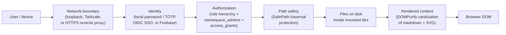
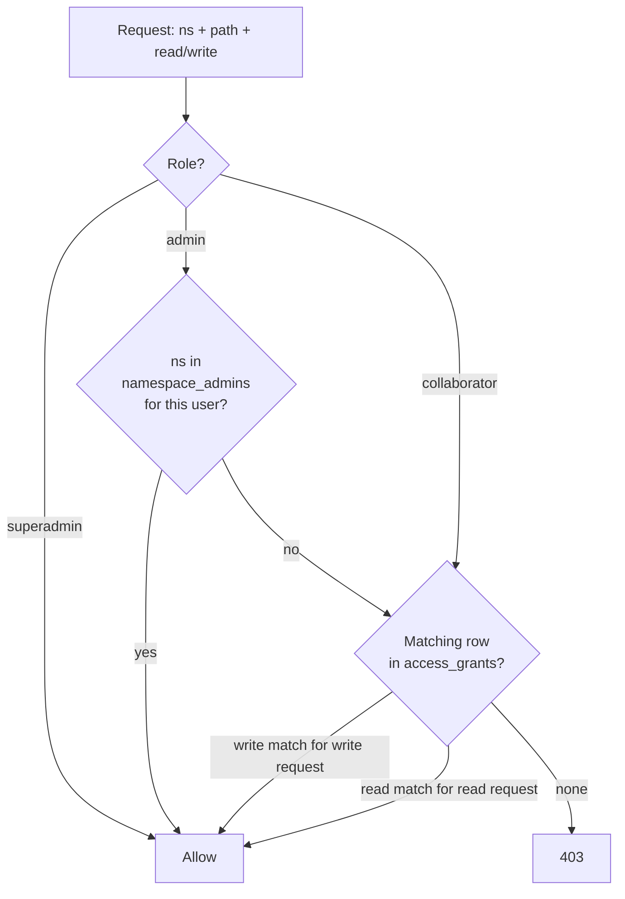

# Security

mdnest is a privately-hosted markdown notes platform that runs across shapes that differ widely in scale and threat model:

- **Solo**: one person on a laptop or a home server, possibly reaching their notes from a phone over a private network.
- **Small team**: a small company's shared knowledge base on a server (cloud VM or on-prem), users signing in through their corporate identity provider, role-based access to namespaces.
- **Organization**: an active/active deployment on Kubernetes — the git-native HA topology (stateless app replicas + a single durability writer coordinated through Redis), an external managed PostgreSQL and Redis, OIDC SSO with domain gating and auto-provisioning, per-namespace RBAC, and per-user OAuth for MCP. It scales horizontally without ReadWriteMany storage, and note history stays plain git, mirrored off-cluster. It is **not** a multi-master or zero-RPO design: writes funnel through one writer, and the HA topology trades a bounded window in which an acknowledged save can be lost — see [kubernetes.md](kubernetes.md) before choosing it.

All three share the same engine and the same authorization model; their threat models differ. This doc explains what's enforced, where the boundaries are, and how to harden each.

---

## Defense layers at a glance



The first four layers are independent gates on the way *in* — a flaw at one is contained by the next, and a request has to pass **all four** to read or write a file. The fifth guards the way *out*: note content is user-authored and shared, so it's sanitized before it reaches the DOM.

---

## Layer 1 — Network boundary

The default `BIND_ADDRESS=127.0.0.1` means the backend and frontend ports are reachable only from the host machine. Nothing on your LAN, your Wi-Fi, or the public internet can touch them. This is the most important boundary on any deployment, single-user or team.

Three supported ways to expose mdnest beyond the host:

### Solo: Tailscale (recommended for personal use)

Tailscale builds an encrypted private network (a tailnet) between machines you control:

- Every connection is end-to-end encrypted with WireGuard.
- Only devices you've authorized can join your tailnet.
- No firewall ports are opened, no public IP is needed.
- `tailscale serve --bg --https 3236 http://127.0.0.1:3236` adds a free trusted HTTPS certificate that's only valid inside your tailnet.

```bash
tailscale serve --bg --https 3236 http://127.0.0.1:3236
```

Result: `https://<your-host>.<tailnet>.ts.net:3236`. Outside the tailnet the hostname doesn't resolve — there's nothing to brute-force.

### Team: HTTPS reverse proxy (recommended for shared deployments)

For a team install reachable from corporate laptops or via SSO redirects, you want a real public-facing TLS endpoint. mdnest ships built-in support for:

- **Caddy** — set `CADDY_DOMAIN=notes.example.com` in `mdnest.conf`. setup.sh adds a Caddy container that handles Let's Encrypt automatically, and the backend/frontend become internal-only (not bound to host ports).
- **Nginx + Certbot** — see `docs/setup.md` for a stock proxy block.
- **Cloudflare Tunnel** — no inbound ports needed; `cloudflared tunnel route dns mdnest notes.example.com` is enough.

In all three cases, mdnest itself stays bound to loopback inside Docker and only the proxy is exposed to the outside world. Set `FRONTEND_ORIGIN=https://notes.example.com` so CORS and SSO callbacks resolve correctly.

### Why not just `BIND_ADDRESS=0.0.0.0`

Binding to all interfaces drops the network boundary entirely. Anyone on the same network sees your login page. That's only acceptable if you're already behind a real reverse proxy that terminates TLS and a firewall that restricts source IPs. **Don't do it on a residential network or a public-IP VM with no proxy in front of it.**

### Multi-IP bind *(v3.8.0+)*

`BIND_ADDRESS` accepts a comma-separated list — the published ports bind to each address independently. The common pattern is `BIND_ADDRESS=127.0.0.1,100.73.118.115`: localhost stays usable on the host, and the Tailscale / WireGuard / VPN address is reachable to your other devices on the overlay network — but the public NIC is still dark. This is strictly safer than `0.0.0.0` because traffic from the LAN or the public internet never reaches the listener at all.

---

## Layer 2 — Identity

Three identity providers are supported in multi-user mode (`AUTH_MODE=multi`), exclusive per server. Plus single-user mode for personal use.

| Mode | `USER_PROVIDER` | Password store | MFA |
|---|---|---|---|
| Single-user | n/a (no `AUTH_MODE`) | bcrypt in `auth.json` | none |
| Multi, local | `local` (default) | bcrypt in Postgres `users.password_hash` | TOTP (per-user, optional or required via `REQUIRE_2FA`) |
| Multi, SSO | `sso` | n/a — IdP owns identity | IdP-managed (Google/Okta/Entra/Keycloak/Auth0) |
| Multi, Firebase | `firebase` | n/a — Firebase Auth owns identity | TOTP stored in Firestore (shared across mdnest servers using the same Firebase project) |

### Local mode (single or multi)

- Passwords are hashed with **bcrypt** before being stored.
- The login handler compares using `crypto/subtle.ConstantTimeCompare` against the bcrypt hash to prevent timing-based username enumeration.
- TOTP (Google Authenticator etc.) can be enforced for all users with `REQUIRE_2FA=true`. Recovery codes are stored hashed in `recovery_codes`.
- Default credentials (`MDNEST_USER=admin / MDNEST_PASSWORD=changeme`) are only used until first login — change them immediately. The backend logs a warning on startup if defaults are still in use.

### SSO mode (`USER_PROVIDER=sso`)

- mdnest acts as an OIDC relying party — it never sees the user's password. The IdP authenticates the user, hands back an ID token, mdnest verifies signature + nonce + state cookie + PKCE verifier and trusts the email claim.
- **MFA is the IdP's responsibility.** mdnest's local TOTP routes are not registered in this mode (`/api/auth/totp/*` returns 404). If your IdP requires MFA for the user, that's already enforced by the time the user lands on mdnest's callback. `REQUIRE_2FA` in `mdnest.conf` is ignored with a log notice.
- **No auto-provisioning.** A successful SSO sign-in still fails with `sso_not_invited` if the email isn't already a row in `users`. Operators invite users via the admin panel before they can sign in. This is the only way to keep authorization decoupled from the IdP — you can have someone with a valid corporate Google account who still can't access mdnest.
- `SSO_ALLOWED_DOMAINS=example.com` adds an additional email-domain allowlist so a typo in the IdP config doesn't accidentally let any verified Google user in.
- The post-callback JWT is the same shape as a local login (HS256, 30-day expiry, `role` + `user_id` claims), and the rest of the app sees a normal session.

### Firebase mode (`USER_PROVIDER=firebase`)

- Frontend signs in via Firebase Auth (Google by default), gets a Firebase ID token, posts it to `/api/auth/login`. Backend verifies the ID token via the Firebase Admin SDK and matches by email.
- TOTP secrets live in Firestore so multiple mdnest servers pointed at the same Firebase project share the same MFA state.

### What gets put in the JWT

Every successful sign-in (any mode, any provider) issues an HS256 JWT containing:

| Claim | Notes |
|---|---|
| `sub` | display name (username, IdP `name` claim, or email — falls back through) |
| `user_id` | Postgres `users.id` |
| `role` | `superadmin`, `admin`, or `collaborator` (v3.5.0+) |
| `totp_enabled` | reflects the user's TOTP state at issue time; refreshed at login |
| `groups` *(v4.2.0+)* | IdP group IDs from `OIDC_GROUPS_CLAIM`, snapshotted at login. Omitted when the IdP emits none or the feature is off. |
| `iat` / `exp` | 30 days (365 with "remember me"; **12 hours for SSO sessions** — see below) |

**Claims are read from the token, not re-checked per request.** `role` and
`groups` are taken from the JWT on every request with no database reload. That
means a role change or a group change does not take effect until the user's next
sign-in. It is why SSO sessions, which carry the `groups` snapshot that drives
authorization, are minted with a deliberately short **12-hour** TTL
(`ssoJWTTTL`) rather than the year-long "remember me" lifetime: it bounds how
long a stale snapshot can outlive a change at the IdP. Password-login TTLs are
unchanged.

If you need to revoke someone *now*, rotate `MDNEST_JWT_SECRET` — that
invalidates every active session immediately.

The JWT is **signed**, not encrypted. Anyone with the token can read its claims. `MDNEST_JWT_SECRET` is the HMAC key — keep it secret, rotate it if you suspect compromise (rotating invalidates every active session immediately).

### API tokens

For headless callers (CLI, MCP server, scripts):

- Generated as 32 cryptographically random bytes encoded as `mdnest_<base64url>`.
- Stored as **SHA-256 hashes** — in Postgres (`api_tokens`) in multi mode, or the `tokens.json` secrets file in single mode. The raw token is shown once on creation and never again.
- Last 4 chars are kept in plain text so they're recognizable in the UI ("ends in `…a3f9`").
- Never expire. Revoke via Settings → API Tokens or `DELETE /api/auth/tokens?id=`.

**Token scope (v3.5.0+):** Tokens resolve to their creator's user context at every request. There is **no system-wide admin bypass** for tokens. Specifically:

- A SuperAdmin's token has full bypass (matches the user).
- A namespace-admin's token gets bypass only on the namespaces in `namespace_admins` for that user (request-time lookup).
- A collaborator's token is limited to their `access_grants`.
- Revoking a user's grant immediately revokes their tokens for that namespace — there's no lag, no per-token cache.

This was a behaviour change from pre-v3.5.0 where any admin token had unconditional global bypass.

---

## Layer 3 — Authorization

In multi-user mode, every namespace-scoped request runs through `middleware.PermissionChecker`. The decision tree:



### Three-tier role hierarchy (v3.5.0+)

| Role | Scope | Capabilities |
|---|---|---|
| **superadmin** | Global | Everything: invite users with any role, manage all grants, promote/demote between roles, delete users, reset 2FA, sync any namespace, manage namespace admins. |
| **admin** | Per-namespace via `namespace_admins(user_id, namespace)` rows | Within their namespaces only: invite users (must specify a namespace they admin), create/edit/revoke grants on those namespaces, promote co-admins, trigger git-sync. Implicit read+write on those namespaces. **Cannot** reset 2FA, delete users, or change global roles — those are SuperAdmin-only. |
| **collaborator** | Per-grant rows in `access_grants` | Read or write only on the namespaces / paths they've been granted. |

`ADMIN_EMAILS` in `mdnest.conf` auto-promotes the listed addresses to `superadmin` on every startup (idempotent). Removals are not auto-demoted — operators demote explicitly.

**First-run bootstrap (v3.11.4+).** On a fresh multi-mode install (empty `users` table) the seeded account — from `MDNEST_USER` / `MDNEST_PASSWORD` — is created as `superadmin`. It's the operator by definition, so it must hold the global role; a namespace-scoped `admin` with no `namespace_admins` rows would see zero namespaces and have no way to grant itself access. The `count == 0` guard restricts this to the very first user, so later invitees are unaffected. (Set a strong `MDNEST_PASSWORD` before first boot — the seed uses it verbatim.)

When mdnest is upgraded from a pre-v3.5.0 install, migration `007_namespace_admins` renames every existing `role='admin'` row to `role='superadmin'` so current operators retain full power. New admins post-upgrade are namespace-scoped — promoted via `POST /api/admin/namespace-admins` or the admin panel's "Namespace Admins" tab.

### Grant model

`access_grants(user_id, namespace, path, permission)`:

- `path='/'` covers the entire namespace; `/foo` covers `/foo` and everything below it.
- `permission` is `read` or `write`. A `write` grant satisfies a `read` request automatically.
- Grants stack — a user can have multiple grants on the same namespace at different paths.

### Access Groups *(v4.2.0+)*

`access_groups` + `access_group_members` + `access_group_grants` add a second,
opt-in source of the same grant shape. Effective access is the **union** of a
user's own grants and the grants of every group they belong to; group access is
consulted only after direct grants fail, and a nil group store disables the layer
entirely (single mode, or no database).

A member row is a mdnest `user_id` **XOR** an `oidc_group` id — enforced by a
database `CHECK`, not just application code. An OIDC-group member may carry a
display label; matching is always on the group id, never the label.

**The two member kinds have different revocation latency, and operators must know
which they're relying on:**

| Member kind | Resolved | Removing access takes effect |
|---|---|---|
| mdnest user | live, per request (`WHERE user_id = …`) | immediately |
| OIDC group id | from the `groups` JWT claim, snapshotted at login | at next sign-in, bounded by the 12h SSO TTL |

So removing someone from a group **in the IdP** is not an immediate revocation of
their mdnest access — it takes effect when their session token expires. Removing
them from the mdnest group, deleting the group, or revoking the group's grant all
take effect at once. For an immediate cut-off regardless of source, block the user
or rotate `MDNEST_JWT_SECRET`.

Group management (`/api/admin/groups*`) is superadmin-only.

### Grant depth limit (v3.5.0+)

`GRANT_MAX_DEPTH` in `mdnest.conf` (default `3`) caps how deep into a namespace tree a grant's path can go:

- `/` → depth 0 (always allowed)
- `/projectA` → 1
- `/projectA/sub` → 2
- `/projectA/sub/leaf` → 3 (allowed at default 3; rejected at 2)

The cap stops admins from creating overly-narrow grants that are hard to audit. Existing grants are grandfathered — only new INSERTs are checked. Set to `0` for no limit. The PathPicker in the admin UI uses the same value to hide too-deep folders, so admins can't pick something the API will reject.

---

## Layer 4 — Path safety

The backend cannot read or write outside your mounted directories, regardless of authorization.

`SafePath` (in `backend/handlers/path.go`) is called by every handler that takes a user-supplied path. It enforces:

- Path must not be empty.
- Cleaned path must not be absolute.
- Cleaned path must not start with `..`.
- After joining with the namespace base directory, the resolved path (with symlinks followed) must remain within the base directory.

`RequireNamespace` validates that `?ns=<name>` is a simple identifier (no slashes, no `.` prefix) and that the directory exists under `NOTES_DIR`.

This blocks:

- `?path=../../../etc/passwd` (parent traversal)
- `?ns=../other-namespace` (sibling escape)
- A symlink in your notes pointing at `/etc/` (resolved and rejected)

Path safety is enforced **before** authorization, so even if the role/grant logic had a bug, the filesystem boundary still holds.

### `/api/files/` takes its namespace from the path *(v3.11.7+)*

Every other content endpoint receives its namespace as `?ns=<name>`, which lets the permission middleware wrap the route generically. `GET /api/files/<ns>/<path>` — the endpoint serving uploaded images and attachments to `` tags — carries the namespace in the URL path instead, so it can't use that middleware and enforces the read check inside the handler.

Before v3.11.7 it enforced **nothing**: the route was registered with authentication only, so any authenticated principal — including an API token — could read any file in any namespace by guessing the URL. It now calls the same `CheckRead(ns, path)` used by `RequireRead`, and returns `403 {"error":"access denied"}` on a namespace the caller has no grant for. Single-user mode constructs the handler with a nil `PermissionChecker` and is unaffected.

If you add a route whose namespace isn't in `?ns=`, the check must be explicit in the handler — the middleware cannot see it. `backend/handlers/upload_test.go` pins this behaviour.

---

## Layer 5 — Rendered content *(v3.11.7+)*

Note bodies are user-authored, and in multi-user mode they're shared between users — so anything a note can put on screen is an injection surface. `marked` passes raw HTML through by design, which means a note containing `` or `<a href="javascript:…">` executed in the browser of anyone who previewed it.

All markup mdnest injects into the DOM now passes through `frontend/src/sanitize.js` (DOMPurify) first. Three call sites are covered:

| Where | Function | What it renders |
|---|---|---|
| `Preview.jsx` | `sanitizeHtml` | `marked()` output for a note body |
| `ReleaseNotesModal.jsx` | `sanitizeHtml` | release notes fetched from the GitHub API |
| `Preview.jsx`, `MermaidViewer.jsx` | `sanitizeSvg` | mermaid-rendered SVG |
| `Preview.jsx` *(v4.2.0+)* | `sanitizeSvg` | Excalidraw-exported SVG for a read-only drawing embed |

Stripped: event-handler attributes (`onerror`, `onclick`, …), dangerous URI schemes (`javascript:`, `data:` in active contexts), `<script>`, `<iframe>`, `<object>`, `<embed>`, `<form>`. Preserved deliberately: `class`, `data-*` (the Preview's mermaid and task-checkbox post-passes depend on them), `<input type="checkbox">` task items, and `target` — with an `afterSanitizeAttributes` hook forcing `rel="noopener noreferrer"` on `target="_blank"` so external links can't reach back into the opener.

**`sanitizeSvg` must keep `foreignObject`.** DOMPurify's SVG profile excludes it, but mermaid renders every flowchart node label inside one (`htmlLabels` defaults to true), so the bare profile silently deletes the text of every label while the shapes still draw. Allowing the element doesn't weaken anything — DOMPurify still descends into the subtree and strips scripts, iframes, and handlers. Don't "fix" it by also allowing `div`/`span`: once those are on the allow-list they fail DOMPurify's namespace check instead of being unwrapped, and the labels disappear again. `frontend/src/__tests__/sanitize.test.js` pins both directions.

**`sanitizeSvg` allows `<use>`, but only same-document references** *(v4.2.0+)*. Excalidraw paints an embedded raster image as a `<symbol>` in `<defs>` referenced by `<use href="#…">`. DOMPurify drops `<use>` by default for a good reason — an off-document `<use href="https://…">` is a classic SVG exfiltration/XSS vector — but with it dropped the `<symbol>` survived in `<defs>`, was never painted, and the image silently vanished from the embed while looking correct in the editor's own canvas. `use` is therefore on the allow-list *paired with* an `afterSanitizeAttributes` hook that removes any `use` whose `href` / `xlink:href` doesn't start with `#`. Both halves are pinned by tests: one asserts a same-document `use` survives, the other asserts an off-document one is dropped — defeating the guard reddens the second.

This is a second layer, not the only one — mermaid also runs at its default `securityLevel: 'strict'`.

### Deck export never sends credentials cross-origin *(v4.2.0+)*

The standalone Marp export inlines images as data URIs, fetching each with the user's session token so `/api/files/…` assets resolve. Deck content is user-authored and shared, so an image URL is attacker-controlled: a deck containing `` would hand the mdnest JWT of whoever exported it to that host. The export therefore attaches `Authorization` **only** when the resolved URL is same-origin; cross-origin images are still fetched (so public assets inline and the deck stays self-contained) but never with credentials, and non-`http(s)` schemes are skipped. This was caught in review and never shipped in a release.

---

## Operational security

### `INSECURE_DEV_LOGIN` — never on prod

For local development and SSO testing, `INSECURE_DEV_LOGIN=true` enables `POST /api/auth/dev-login` that mints a session JWT for any existing user by email — bypassing the IdP entirely. Identity rules still match SSO (the email must be invited; blocked users still rejected), but there is **no OAuth round-trip and no MFA**. While enabled:

- Backend logs a five-line `WARNING` block at startup.
- A red `⚠ DEV LOGIN` pill is fixed to the bottom-right corner of every authenticated page; hovering shows the full warning.
- `/api/config` returns `devLoginEnabled: true` so any tool can detect the flag.

The flag is off by default. Never set it on a non-localhost deployment — anyone who can reach the backend port can impersonate any user.

### Password reset access boundary *(v3.6.0+)*

Resetting another user's password is a privileged operation, and the system splits it into two paths with deliberately different access bars.

| Reset target | Allowed actor | Path |
|---|---|---|
| Collaborator / namespace-admin | Any super-admin | Admin Panel → Users → **Reset password** (`POST /api/admin/reset-password`) |
| Super-admin | Anyone with shell access on the host | `./mdnest-server reset-password <email>` |

The web endpoint refuses to act on a super-admin target (`403`). That's deliberate: web sessions are easier to compromise than host-shell access, and "any super-admin can replace any other super-admin's password from the UI" is a one-click takeover primitive — one phished super-admin can lock out every other super-admin and then own the system. Forcing the cross-super-admin case through the host CLI raises the bar to whoever has SSH on the box, which is typically a much smaller and better-protected set of people.

Both paths set `must_change_password=true` so the temp password is single-use — the target is forced to pick their own on next login before they can reach anything else in the app.

The host CLI accepts the new password on stdin (not as an argv argument), so it never appears in `ps`, the shell history, or the audit log. Backend logs the actor + target user IDs and the email, but never the password itself.

This whole feature only applies in `USER_PROVIDER=local`. In Firebase / SSO mode the IdP owns the password and both paths refuse.

### Outbound GitHub poll *(v3.8.0+)*

mdnest's backend reaches out to `api.github.com` once per hour to check whether a newer release is available, so the sidebar can surface release notes when one drops (was once every 24 hours pre-v3.10.1 — the longer cadence meant operators sometimes waited a full day to see the banner after a release shipped). This is the only outbound network call the backend itself makes; everything else stays inside your install.

- **What gets sent.** A single unauthenticated GET to `https://api.github.com/repos/<UPDATE_CHECK_REPO>/releases/latest`. No headers identify your install — GitHub sees ~24 requests per day from your server's egress IP, well inside the 60 requests/hour unauthenticated rate limit even with multiple installs sharing one IP.
- **What gets stored.** The latest release's `tag_name`, `name`, `published_at`, and the markdown `body` (truncated to 8 KB), held in memory only. Nothing is persisted server-side. Frontend dismissals (per-version "don't remind me") live in browser localStorage.
- **Failure mode.** Network errors are logged at info level and never block startup or any user-facing path.
- **Opt-out.** Set `DISABLE_UPDATE_CHECK=true` in `mdnest.conf` for air-gapped or privacy-sensitive installs. The badge disappears and the goroutine never starts. Set `UPDATE_CHECK_REPO=<owner>/<repo>` to point at a fork instead of upstream.
- **User IPs.** End-user browsers do not contact GitHub. The check happens server-side; the client only reads the cached result from `/api/config`.

### Per-workspace git credentials — sealing, fail-closed & rotation *(multi mode)*

When a namespace mirrors to its own repository (Admin → Git Workspaces / Settings → Git remote), the supplied credential — an HTTPS PAT or an SSH private key, the most sensitive data mdnest holds — is sealed at rest with **AES-256-GCM** in the `workspaces` (and `workspace_groups`) table. The key is derived (SHA-256) from `MDNEST_ENCRYPTION_KEY`, which falls back to `MDNEST_JWT_SECRET`.

- **Never read back.** The API only ever reports `has_credential`; the ciphertext is decrypted solely at push time, in the writer, to build the git operation. It is never returned to a client and never logged.
- **Never in argv or a URL.** HTTPS uses a `GIT_ASKPASS` helper reading a private temp file; SSH stages the key to a private temp file wired through `GIT_SSH_COMMAND -i`. Only the *username* is embedded in the remote URL. Staged secret files are removed after each push, and `GIT_TERMINAL_PROMPT=0` prevents interactive prompts.
- **Fail-closed.** If `MDNEST_ENCRYPTION_KEY` is unset **and** `MDNEST_JWT_SECRET` is still the default, mdnest **refuses** to enable mirroring or store a credential (HTTP `403`) rather than sealing secrets under a guessable key. Startup logs a warning. Set a dedicated, high-entropy `MDNEST_ENCRYPTION_KEY` to enable the feature.
- **Rotation is a re-credentialing event.** There is no key-versioned envelope, so **changing `MDNEST_ENCRYPTION_KEY` makes every stored credential undecryptable**. Sync then fails and the error surfaces in the Git-remote tab (`last_sync_error`). Recovery: each owner re-enters their token / key from **Settings → Git remote**; a super-admin re-enters shared and group credentials. Plan the rotation as a maintenance window and notify owners. *(A future key-versioned envelope could allow rolling rotation without re-entry — tracked as a follow-up.)*
- **No flag smuggling.** `remote_url` and `branch` are positional arguments to `git`, so a value starting with `-` would otherwise be parsed as an option (`--upload-pack=<cmd>` executes `<cmd>`). The API rejects both shapes and the exec site passes `--end-of-options`; either layer alone stops it.
- **Blast radius.** The key lives in the pod, so a compromised pod can decrypt stored credentials. Mitigate by using repo-scoped, revocable credentials (fine-grained PATs / deploy tokens / deploy keys), never account-wide secrets. The writer's egress NetworkPolicy plus the optional `GIT_REMOTE_ALLOWED_HOSTS` allow-list bound where those credentials can be used.

### Secrets to rotate

| Secret | Where | When to rotate |
|---|---|---|
| `MDNEST_JWT_SECRET` | `mdnest.conf` | If you suspect compromise. Rotation invalidates every active session immediately. **If `MDNEST_ENCRYPTION_KEY` is unset, git credentials are sealed under this secret, so rotating it also makes them undecryptable** — set a dedicated `MDNEST_ENCRYPTION_KEY` so the two can be rotated independently. |
| `MDNEST_ENCRYPTION_KEY` | `mdnest.conf` | If you suspect the git-credential store is compromised. **Rotation makes stored per-workspace git credentials undecryptable** — owners must re-enter their token / key afterwards (see above). |
| `POSTGRES_PASSWORD` | `mdnest.conf` | After any DBA hand-off. Update + `mdnest-server rebuild`. |
| `SSO_CLIENT_SECRET` | `mdnest.conf` | If the IdP-issued secret leaks. Generate a new one in the IdP's admin console, swap in `mdnest.conf`, `./mdnest-server reload`. |
| Git deploy keys | `git-sync/keys/` | If a key leaks; rotation also requires updating the key in the git provider. |

### What gets logged

The backend logs to stdout (captured by Docker):

- Every login (`local login: ahsan (id=2)`, `sso login: chooza (id=4)`).
- Every admin action (invite, role change, grant create/delete, namespace_admin promote/demote, 2FA reset, git sync).
- Every `INSECURE_DEV_LOGIN` token mint (with the email).
- Migrations on startup.
- Failed login attempts (no rate limit; rely on the network boundary).

Logs do not include passwords, tokens, or note content. Email addresses do appear — handle log retention accordingly.

### Database backups

Notes are plain files — back them up with `rsync`, `git`, or whatever tool already covers the host. The Postgres database stores user accounts and grants only (no note content). Standard `pg_dump` on a schedule covers it; the schema fits comfortably in a small dump.

### Docker image freshness

The Postgres driver is `jackc/pgx/v5` *(since v4.2.1)*. It replaced
`github.com/lib/pq`, which is in maintenance mode and carries seven advisories
that will not be fixed (GO-2026-6166/6168/6170–6173, every one `Fixed in: N/A`,
including a malformed-frame panic and GSS authentication completing without
mutual proof). Because `Backend (govulncheck)` is a required check on `main`
with no bypass actors, an unfixable advisory in a direct dependency blocks every
release until the dependency is replaced — which is the intended behaviour of
that gate, not an obstacle to route around.

Both base images are pinned to moving tags (`golang:1.26-alpine`, `node:20-alpine`, `nginx:alpine`, `postgres:16-alpine`, `alpine:latest`) so a `./mdnest-server rebuild` pulls the latest patch automatically. The CI workflow's `Backend (govulncheck)` job runs against `go-version-file: backend/go.mod` so it tracks whatever the build image is using.

---

## Request limits

| Resource | Limit |
|---|---|
| Note content (create/update) | 10 MB |
| File upload | 32 MB |
| Search results | 30 per query (configurable via `SEARCH_MAX_RESULTS`) |
| JWT expiry | 30 days |
| Login rate limit | none (relies on network boundary) |
| API token expiry | none (revoke manually) |

---

## Recommendations by deployment shape

### Solo (single-user mode or multi/local)

1. Keep `BIND_ADDRESS=127.0.0.1` (the default).
2. Use Tailscale for remote access — never open ports publicly.
3. Change default credentials immediately after first run.
4. Use API tokens for the CLI / MCP server, not your password.
5. Enable `REQUIRE_2FA=true` if multiple devices share a tailnet.
6. Encrypt the host disk if the laptop / VM might be physically lost.

### Team (multi/SSO, shared)

1. Put mdnest behind a TLS reverse proxy — Caddy is the simplest. The backend stays loopback-only.
2. Use SSO (`USER_PROVIDER=sso`) so identity is centralized and MFA is enforced by the IdP.
3. Set `SSO_ALLOWED_DOMAINS=<your domain>` as a belt-and-suspenders email-domain allowlist.
4. Pre-invite users via the admin panel before their first sign-in (no auto-provisioning).
5. Use `ADMIN_EMAILS` for one or two ops superadmins; assign per-team admins via the **Namespace Admins** tab.
6. Set a sane `GRANT_MAX_DEPTH` (default 3 fits most structures).
7. Rotate `SSO_CLIENT_SECRET` and `MDNEST_JWT_SECRET` on a schedule that matches your org's policy.
8. Snapshot Postgres regularly. Notes already go to Git via the optional sync sidecar.
9. **Never** set `INSECURE_DEV_LOGIN=true`. The startup log warning + fixed-position pill are designed to make accidental enablement obvious, but the sane move is to leave it commented out in the conf.

---

## What mdnest does not do

- **No login rate limiting.** The network boundary is the primary defense; a public-internet deployment without a reverse proxy that handles rate limiting is unsupported.
- **No encryption at rest.** Notes are plain markdown on disk. Encrypt the disk if you need that.
- **No audit log table.** Admin actions go to stdout / Docker logs only — wire those into your log infrastructure if you need long-term audit. (A built-in audit table is a candidate for a future release.)
- **No per-comment authorization beyond "author or admin".** Any admin (role) can edit/delete any comment in their scope — fine for moderation, but not strict authorship enforcement.
- **No SAML / WS-Fed.** Identity providers must speak OIDC. (Most enterprise IdPs do, including Okta, Entra ID, Keycloak, Auth0.)
- **No anonymous read-only sharing.** All access requires a signed-in user; there's no public-link export.

These are intentional trade-offs to keep the codebase small. Most are addressable with a reverse proxy, the host's disk encryption, or external log shipping.
