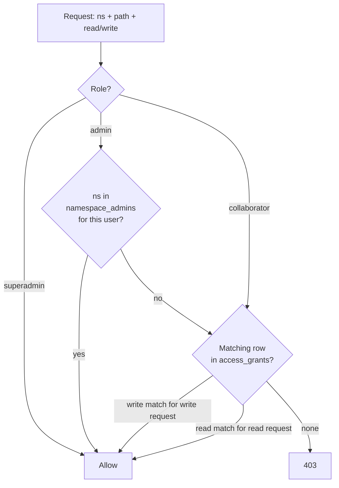

# Security

mdnest is a privately-hosted markdown notes platform that runs across two very different shapes:

- **Solo**: one person on a laptop or a home server, possibly reaching their notes from a phone over a private network.
- **Small team**: a small company's shared knowledge base on a server (cloud VM or on-prem), users signing in through their corporate identity provider, role-based access to namespaces.

Both shapes share the same engine but their threat models differ. This doc explains what's enforced, where the boundaries are, and how to harden each setup.

---

## Defense layers at a glance

```mermaid
flowchart LR
    user[User / device] --> net[Network boundary<br/>(loopback, Tailscale,<br/>or HTTPS reverse proxy)]
    net --> idp[Identity<br/>(local password / TOTP,<br/>OIDC SSO, or Firebase)]
    idp --> authz[Authorization<br/>(role hierarchy +<br/>namespace_admins +<br/>access_grants)]
    authz --> path[Path safety<br/>(SafePath traversal<br/>protection)]
    path --> fs[Files on disk<br/>inside mounted dirs]
```

Each layer is independent — a flaw at one is contained by the next. A request has to pass **all four** to read or write a file.

---

## Layer 1 — Network boundary

The default `BIND_ADDRESS=127.0.0.1` means the backend and frontend ports are reachable only from the host machine. Nothing on your LAN, your Wi-Fi, or the public internet can touch them. This is the most important boundary on any deployment, single-user or team.

Three supported ways to expose mdnest beyond the host:

### Solo: Tailscale (recommended for personal use)

Tailscale builds an encrypted private network (a tailnet) between machines you control:

- Every connection is end-to-end encrypted with WireGuard.
- Only devices you've authorized can join your tailnet.
- No firewall ports are opened, no public IP is needed.
- `tailscale serve --bg --https 3236 http://127.0.0.1:3236` adds a free trusted HTTPS certificate that's only valid inside your tailnet.

```bash
tailscale serve --bg --https 3236 http://127.0.0.1:3236
```

Result: `https://<your-host>.<tailnet>.ts.net:3236`. Outside the tailnet the hostname doesn't resolve — there's nothing to brute-force.

### Team: HTTPS reverse proxy (recommended for shared deployments)

For a team install reachable from corporate laptops or via SSO redirects, you want a real public-facing TLS endpoint. mdnest ships built-in support for:

- **Caddy** — set `CADDY_DOMAIN=notes.example.com` in `mdnest.conf`. setup.sh adds a Caddy container that handles Let's Encrypt automatically, and the backend/frontend become internal-only (not bound to host ports).
- **Nginx + Certbot** — see `docs/setup.md` for a stock proxy block.
- **Cloudflare Tunnel** — no inbound ports needed; `cloudflared tunnel route dns mdnest notes.example.com` is enough.

In all three cases, mdnest itself stays bound to loopback inside Docker and only the proxy is exposed to the outside world. Set `FRONTEND_ORIGIN=https://notes.example.com` so CORS and SSO callbacks resolve correctly.

### Why not just `BIND_ADDRESS=0.0.0.0`

Binding to all interfaces drops the network boundary entirely. Anyone on the same network sees your login page. That's only acceptable if you're already behind a real reverse proxy that terminates TLS and a firewall that restricts source IPs. **Don't do it on a residential network or a public-IP VM with no proxy in front of it.**

### Multi-IP bind *(v3.8.0+)*

`BIND_ADDRESS` accepts a comma-separated list — the published ports bind to each address independently. The common pattern is `BIND_ADDRESS=127.0.0.1,100.73.118.115`: localhost stays usable on the host, and the Tailscale / WireGuard / VPN address is reachable to your other devices on the overlay network — but the public NIC is still dark. This is strictly safer than `0.0.0.0` because traffic from the LAN or the public internet never reaches the listener at all.

---

## Layer 2 — Identity

Three identity providers are supported in multi-user mode (`AUTH_MODE=multi`), exclusive per server. Plus single-user mode for personal use.

| Mode | `USER_PROVIDER` | Password store | MFA |
|---|---|---|---|
| Single-user | n/a (no `AUTH_MODE`) | bcrypt in `auth.json` | none |
| Multi, local | `local` (default) | bcrypt in Postgres `users.password_hash` | TOTP (per-user, optional or required via `REQUIRE_2FA`) |
| Multi, SSO | `sso` | n/a — IdP owns identity | IdP-managed (Google/Okta/Entra/Keycloak/Auth0) |
| Multi, Firebase | `firebase` | n/a — Firebase Auth owns identity | TOTP stored in Firestore (shared across mdnest servers using the same Firebase project) |

### Local mode (single or multi)

- Passwords are hashed with **bcrypt** before being stored.
- The login handler compares using `crypto/subtle.ConstantTimeCompare` against the bcrypt hash to prevent timing-based username enumeration.
- TOTP (Google Authenticator etc.) can be enforced for all users with `REQUIRE_2FA=true`. Recovery codes are stored hashed in `recovery_codes`.
- Default credentials (`MDNEST_USER=admin / MDNEST_PASSWORD=changeme`) are only used until first login — change them immediately. The backend logs a warning on startup if defaults are still in use.

### SSO mode (`USER_PROVIDER=sso`)

- mdnest acts as an OIDC relying party — it never sees the user's password. The IdP authenticates the user, hands back an ID token, mdnest verifies signature + nonce + state cookie + PKCE verifier and trusts the email claim.
- **MFA is the IdP's responsibility.** mdnest's local TOTP routes are not registered in this mode (`/api/auth/totp/*` returns 404). If your IdP requires MFA for the user, that's already enforced by the time the user lands on mdnest's callback. `REQUIRE_2FA` in `mdnest.conf` is ignored with a log notice.
- **No auto-provisioning.** A successful SSO sign-in still fails with `sso_not_invited` if the email isn't already a row in `users`. Operators invite users via the admin panel before they can sign in. This is the only way to keep authorization decoupled from the IdP — you can have someone with a valid corporate Google account who still can't access mdnest.
- `SSO_ALLOWED_DOMAINS=example.com` adds an additional email-domain allowlist so a typo in the IdP config doesn't accidentally let any verified Google user in.
- The post-callback JWT is the same shape as a local login (HS256, 30-day expiry, `role` + `user_id` claims), and the rest of the app sees a normal session.

### Firebase mode (`USER_PROVIDER=firebase`)

- Frontend signs in via Firebase Auth (Google by default), gets a Firebase ID token, posts it to `/api/auth/login`. Backend verifies the ID token via the Firebase Admin SDK and matches by email.
- TOTP secrets live in Firestore so multiple mdnest servers pointed at the same Firebase project share the same MFA state.

### What gets put in the JWT

Every successful sign-in (any mode, any provider) issues an HS256 JWT containing:

| Claim | Notes |
|---|---|
| `sub` | display name (username, IdP `name` claim, or email — falls back through) |
| `user_id` | Postgres `users.id` |
| `role` | `superadmin`, `admin`, or `collaborator` (v3.5.0+) |
| `totp_enabled` | reflects the user's TOTP state at issue time; refreshed at login |
| `iat` / `exp` | 30 days |

The JWT is **signed**, not encrypted. Anyone with the token can read its claims. `MDNEST_JWT_SECRET` is the HMAC key — keep it secret, rotate it if you suspect compromise (rotating invalidates every active session immediately).

### API tokens

For headless callers (CLI, MCP server, scripts):

- Generated as 32 cryptographically random bytes encoded as `mdnest_<base64url>`.
- Stored as **SHA-256 hashes** in the secrets volume — the raw token is shown once on creation and never again.
- Last 4 chars are kept in plain text so they're recognizable in the UI ("ends in `…a3f9`").
- Never expire. Revoke via Settings → API Tokens or `DELETE /api/auth/tokens?id=`.

**Token scope (v3.5.0+):** Tokens resolve to their creator's user context at every request. There is **no system-wide admin bypass** for tokens. Specifically:

- A SuperAdmin's token has full bypass (matches the user).
- A namespace-admin's token gets bypass only on the namespaces in `namespace_admins` for that user (request-time lookup).
- A collaborator's token is limited to their `access_grants`.
- Revoking a user's grant immediately revokes their tokens for that namespace — there's no lag, no per-token cache.

This was a behaviour change from pre-v3.5.0 where any admin token had unconditional global bypass.

---

## Layer 3 — Authorization

In multi-user mode, every namespace-scoped request runs through `middleware.PermissionChecker`. The decision tree:



### Three-tier role hierarchy (v3.5.0+)

| Role | Scope | Capabilities |
|---|---|---|
| **superadmin** | Global | Everything: invite users with any role, manage all grants, promote/demote between roles, delete users, reset 2FA, sync any namespace, manage namespace admins. |
| **admin** | Per-namespace via `namespace_admins(user_id, namespace)` rows | Within their namespaces only: invite users (must specify a namespace they admin), create/edit/revoke grants on those namespaces, promote co-admins, trigger git-sync. Implicit read+write on those namespaces. **Cannot** reset 2FA, delete users, or change global roles — those are SuperAdmin-only. |
| **collaborator** | Per-grant rows in `access_grants` | Read or write only on the namespaces / paths they've been granted. |

`ADMIN_EMAILS` in `mdnest.conf` auto-promotes the listed addresses to `superadmin` on every startup (idempotent). Removals are not auto-demoted — operators demote explicitly.

When mdnest is upgraded from a pre-v3.5.0 install, migration `007_namespace_admins` renames every existing `role='admin'` row to `role='superadmin'` so current operators retain full power. New admins post-upgrade are namespace-scoped — promoted via `POST /api/admin/namespace-admins` or the admin panel's "Namespace Admins" tab.

### Grant model

`access_grants(user_id, namespace, path, permission)`:

- `path='/'` covers the entire namespace; `/foo` covers `/foo` and everything below it.
- `permission` is `read` or `write`. A `write` grant satisfies a `read` request automatically.
- Grants stack — a user can have multiple grants on the same namespace at different paths.

### Grant depth limit (v3.5.0+)

`GRANT_MAX_DEPTH` in `mdnest.conf` (default `3`) caps how deep into a namespace tree a grant's path can go:

- `/` → depth 0 (always allowed)
- `/projectA` → 1
- `/projectA/sub` → 2
- `/projectA/sub/leaf` → 3 (allowed at default 3; rejected at 2)

The cap stops admins from creating overly-narrow grants that are hard to audit. Existing grants are grandfathered — only new INSERTs are checked. Set to `0` for no limit. The PathPicker in the admin UI uses the same value to hide too-deep folders, so admins can't pick something the API will reject.

---

## Layer 4 — Path safety

The backend cannot read or write outside your mounted directories, regardless of authorization.

`SafePath` (in `backend/handlers/path.go`) is called by every handler that takes a user-supplied path. It enforces:

- Path must not be empty.
- Cleaned path must not be absolute.
- Cleaned path must not start with `..`.
- After joining with the namespace base directory, the resolved path (with symlinks followed) must remain within the base directory.

`RequireNamespace` validates that `?ns=<name>` is a simple identifier (no slashes, no `.` prefix) and that the directory exists under `NOTES_DIR`.

This blocks:

- `?path=../../../etc/passwd` (parent traversal)
- `?ns=../other-namespace` (sibling escape)
- A symlink in your notes pointing at `/etc/` (resolved and rejected)

Path safety is enforced **before** authorization, so even if the role/grant logic had a bug, the filesystem boundary still holds.

---

## Operational security

### `INSECURE_DEV_LOGIN` — never on prod

For local development and SSO testing, `INSECURE_DEV_LOGIN=true` enables `POST /api/auth/dev-login` that mints a session JWT for any existing user by email — bypassing the IdP entirely. Identity rules still match SSO (the email must be invited; blocked users still rejected), but there is **no OAuth round-trip and no MFA**. While enabled:

- Backend logs a five-line `WARNING` block at startup.
- A red `⚠ DEV LOGIN` pill is fixed to the bottom-right corner of every authenticated page; hovering shows the full warning.
- `/api/config` returns `devLoginEnabled: true` so any tool can detect the flag.

The flag is off by default. Never set it on a non-localhost deployment — anyone who can reach the backend port can impersonate any user.

### Password reset access boundary *(v3.6.0+)*

Resetting another user's password is a privileged operation, and the system splits it into two paths with deliberately different access bars.

| Reset target | Allowed actor | Path |
|---|---|---|
| Collaborator / namespace-admin | Any super-admin | Admin Panel → Users → **Reset password** (`POST /api/admin/reset-password`) |
| Super-admin | Anyone with shell access on the host | `./mdnest-server reset-password <email>` |

The web endpoint refuses to act on a super-admin target (`403`). That's deliberate: web sessions are easier to compromise than host-shell access, and "any super-admin can replace any other super-admin's password from the UI" is a one-click takeover primitive — one phished super-admin can lock out every other super-admin and then own the system. Forcing the cross-super-admin case through the host CLI raises the bar to whoever has SSH on the box, which is typically a much smaller and better-protected set of people.

Both paths set `must_change_password=true` so the temp password is single-use — the target is forced to pick their own on next login before they can reach anything else in the app.

The host CLI accepts the new password on stdin (not as an argv argument), so it never appears in `ps`, the shell history, or the audit log. Backend logs the actor + target user IDs and the email, but never the password itself.

This whole feature only applies in `USER_PROVIDER=local`. In Firebase / SSO mode the IdP owns the password and both paths refuse.

### Outbound GitHub poll *(v3.8.0+)*

mdnest's backend reaches out to `api.github.com` once every 24 hours to check whether a newer release is available, so the sidebar can surface release notes when one drops. This is the only outbound network call the backend itself makes; everything else stays inside your install.

- **What gets sent.** A single unauthenticated GET to `https://api.github.com/repos/<UPDATE_CHECK_REPO>/releases/latest`. No headers identify your install — GitHub sees one request from your server's egress IP per day.
- **What gets stored.** The latest release's `tag_name`, `name`, `published_at`, and the markdown `body` (truncated to 8 KB), held in memory only. Nothing is persisted server-side. Frontend dismissals (per-version "don't remind me") live in browser localStorage.
- **Failure mode.** Network errors are logged at info level and never block startup or any user-facing path.
- **Opt-out.** Set `DISABLE_UPDATE_CHECK=true` in `mdnest.conf` for air-gapped or privacy-sensitive installs. The badge disappears and the goroutine never starts. Set `UPDATE_CHECK_REPO=<owner>/<repo>` to point at a fork instead of upstream.
- **User IPs.** End-user browsers do not contact GitHub. The check happens server-side; the client only reads the cached result from `/api/config`.

### Secrets to rotate

| Secret | Where | When to rotate |
|---|---|---|
| `MDNEST_JWT_SECRET` | `mdnest.conf` | If you suspect compromise. Rotation invalidates every active session immediately. |
| `POSTGRES_PASSWORD` | `mdnest.conf` | After any DBA hand-off. Update + `mdnest-server rebuild`. |
| `SSO_CLIENT_SECRET` | `mdnest.conf` | If the IdP-issued secret leaks. Generate a new one in the IdP's admin console, swap in `mdnest.conf`, `./mdnest-server reload`. |
| Git deploy keys | `git-sync/keys/` | If a key leaks; rotation also requires updating the key in the git provider. |

### What gets logged

The backend logs to stdout (captured by Docker):

- Every login (`local login: ahsan (id=2)`, `sso login: chooza (id=4)`).
- Every admin action (invite, role change, grant create/delete, namespace_admin promote/demote, 2FA reset, git sync).
- Every `INSECURE_DEV_LOGIN` token mint (with the email).
- Migrations on startup.
- Failed login attempts (no rate limit; rely on the network boundary).

Logs do not include passwords, tokens, or note content. Email addresses do appear — handle log retention accordingly.

### Database backups

Notes are plain files — back them up with `rsync`, `git`, or whatever tool already covers the host. The Postgres database stores user accounts and grants only (no note content). Standard `pg_dump` on a schedule covers it; the schema fits comfortably in a small dump.

### Docker image freshness

Both base images are pinned to moving tags (`golang:1.26-alpine`, `node:20-alpine`, `nginx:alpine`, `postgres:16-alpine`, `alpine:latest`) so a `./mdnest-server rebuild` pulls the latest patch automatically. The CI workflow's `Backend (govulncheck)` job runs against `go-version-file: backend/go.mod` so it tracks whatever the build image is using.

---

## Request limits

| Resource | Limit |
|---|---|
| Note content (create/update) | 10 MB |
| File upload | 32 MB |
| Search results | 30 per query (configurable via `SEARCH_MAX_RESULTS`) |
| JWT expiry | 30 days |
| Login rate limit | none (relies on network boundary) |
| API token expiry | none (revoke manually) |

---

## Recommendations by deployment shape

### Solo (single-user mode or multi/local)

1. Keep `BIND_ADDRESS=127.0.0.1` (the default).
2. Use Tailscale for remote access — never open ports publicly.
3. Change default credentials immediately after first run.
4. Use API tokens for the CLI / MCP server, not your password.
5. Enable `REQUIRE_2FA=true` if multiple devices share a tailnet.
6. Encrypt the host disk if the laptop / VM might be physically lost.

### Team (multi/SSO, shared)

1. Put mdnest behind a TLS reverse proxy — Caddy is the simplest. The backend stays loopback-only.
2. Use SSO (`USER_PROVIDER=sso`) so identity is centralized and MFA is enforced by the IdP.
3. Set `SSO_ALLOWED_DOMAINS=<your domain>` as a belt-and-suspenders email-domain allowlist.
4. Pre-invite users via the admin panel before their first sign-in (no auto-provisioning).
5. Use `ADMIN_EMAILS` for one or two ops superadmins; assign per-team admins via the **Namespace Admins** tab.
6. Set a sane `GRANT_MAX_DEPTH` (default 3 fits most structures).
7. Rotate `SSO_CLIENT_SECRET` and `MDNEST_JWT_SECRET` on a schedule that matches your org's policy.
8. Snapshot Postgres regularly. Notes already go to Git via the optional sync sidecar.
9. **Never** set `INSECURE_DEV_LOGIN=true`. The startup log warning + fixed-position pill are designed to make accidental enablement obvious, but the sane move is to leave it commented out in the conf.

---

## What mdnest does not do

- **No login rate limiting.** The network boundary is the primary defense; a public-internet deployment without a reverse proxy that handles rate limiting is unsupported.
- **No encryption at rest.** Notes are plain markdown on disk. Encrypt the disk if you need that.
- **No audit log table.** Admin actions go to stdout / Docker logs only — wire those into your log infrastructure if you need long-term audit. (A built-in audit table is a candidate for a future release.)
- **No per-comment authorization beyond "author or admin".** Any admin (role) can edit/delete any comment in their scope — fine for moderation, but not strict authorship enforcement.
- **No SAML / WS-Fed.** Identity providers must speak OIDC. (Most enterprise IdPs do, including Okta, Entra ID, Keycloak, Auth0.)
- **No anonymous read-only sharing.** All access requires a signed-in user; there's no public-link export.

These are intentional trade-offs to keep the codebase small. Most are addressable with a reverse proxy, the host's disk encryption, or external log shipping.
