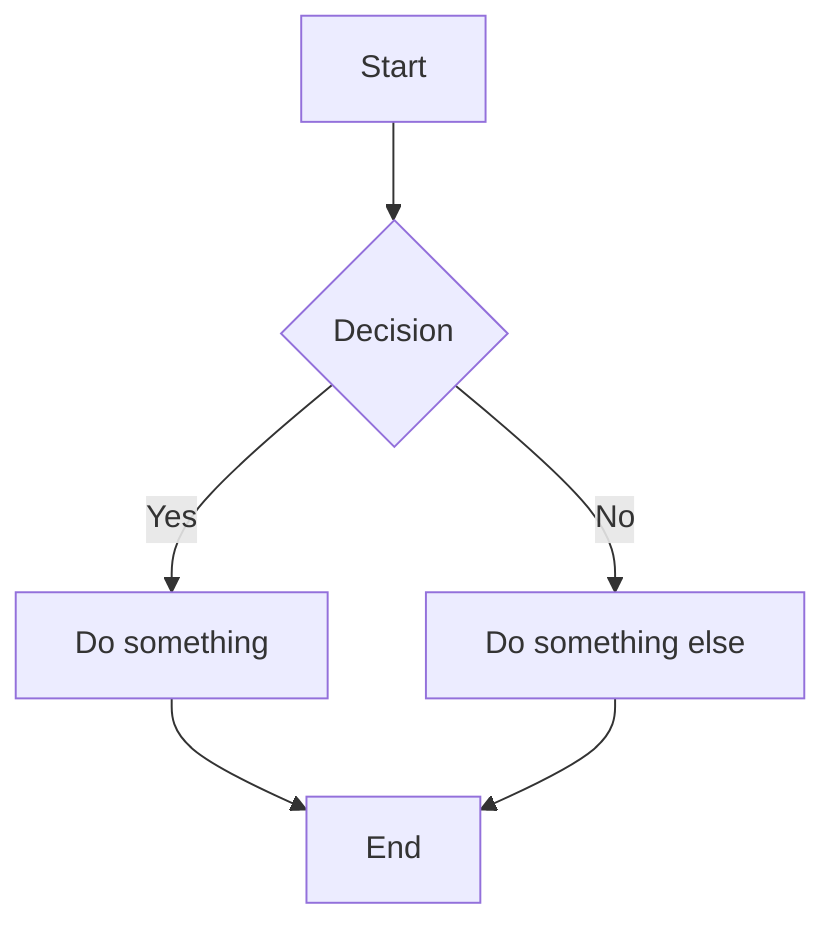

# mdnest User Guide

mdnest is a privately-hosted markdown notes app. Your notes are plain `.md` files on disk, and mdnest provides a clean web interface to browse, edit, and organize them. It works for personal use (single-user mode) or team collaboration (multi-user mode).

---

## Getting Started

### Logging In

Open mdnest in your browser (e.g., `http://localhost:3236`). You will see a login screen. In single-user mode, enter the username and password from your configuration (`MDNEST_USER` and `MDNEST_PASSWORD`). In multi-user mode, use the credentials provided by your admin.

After a successful login, the session lasts 24 hours before you need to log in again.

### Your First Note

1. In the sidebar, select a namespace (the dropdown at the top).
2. Click the **New Note** button in the toolbar.
3. Enter a filename (e.g., `hello.md`).
4. Start typing in the editor. Your changes are saved when you stop editing.

---

## The Sidebar

The left sidebar contains two key elements:

### Namespace Selector

The dropdown at the top of the sidebar lists all configured namespaces. Each namespace corresponds to a separate directory on the host machine. Select a namespace to browse its file tree.

### Folder Tree

Below the namespace selector, the folder tree shows all files and folders in the selected namespace. Folders appear before files, and both are sorted alphabetically.

- Click a **folder** to expand or collapse it.
- Click a **file** to open it in the editor.
- Hidden files (those starting with `.`) are not shown. This keeps `.git` directories and other dotfiles out of the way.

On mobile, tap the hamburger menu icon in the top-left corner to show or hide the sidebar.

---

## Creating Notes and Folders

There are two ways to create notes and folders.

### Toolbar Buttons

At the top of the sidebar:

- **New Note** -- creates a new markdown file. You will be prompted for a filename. The file is created inside whichever folder is currently selected (or the root if none is selected).
- **New Folder** -- creates a new folder. You will be prompted for a name.

### Context Menu

Right-click (desktop) or long-press (mobile) on any folder in the tree to open a context menu with options to:

- Create a new note inside that folder
- Create a new subfolder
- Rename the folder
- Delete the folder and its contents

Right-click or long-press on a file to:

- Rename the file
- Delete the file

---

## Editing

### The Markdown Editor

Clicking a file in the sidebar opens it in the editor pane. The editor is a plain-text area where you write standard markdown.

Changes are saved automatically. There is no manual save button -- your edits are sent to the backend as you type.

### Formatting Toolbar

Above the editor, the formatting toolbar provides buttons for common markdown operations:

- **Bold** -- wraps selected text with `**`
- **Italic** -- wraps selected text with `_`
- **Heading** -- inserts a `#` prefix
- **Link** -- inserts a `[text](url)` template
- **Code** -- wraps selection with backticks (inline) or triple backticks (block)
- **List** -- inserts a `- ` prefix for unordered lists
- **Checkbox** -- inserts a `- [ ] ` prefix for task lists

### Indentation

Press **Tab** in the editor to indent the current line. This is useful for nesting list items.

---

## Live Preview

The preview pane renders your markdown in real time as you type. The following elements are supported:

- Standard markdown: headings, bold, italic, links, images, blockquotes, code blocks, tables, horizontal rules
- Fenced code blocks with syntax highlighting
- Mermaid diagrams
- Task checkboxes
- Inline and referenced images (including uploaded images)

### Editor and Preview Layout

On desktop, the editor and preview appear side by side.

On mobile, you toggle between editor and preview views since there is not enough screen space for both.

---

## Mermaid Diagrams

mdnest renders [Mermaid](https://mermaid.js.org/) diagrams inside fenced code blocks tagged with `mermaid`.

**Syntax:**

````markdown

````

This renders as an interactive diagram in the preview pane. Mermaid supports many diagram types including flowcharts, sequence diagrams, Gantt charts, class diagrams, and more. Refer to the [Mermaid documentation](https://mermaid.js.org/intro/) for the full syntax reference.

---

## Task Checkboxes

Standard markdown task list syntax is supported:

```markdown
- [ ] Unchecked item
- [x] Checked item
```

In the preview pane, checkboxes are rendered as interactive elements. Clicking a checkbox toggles its state and updates the underlying markdown file automatically.

---

## Image Upload

mdnest supports uploading images directly into your notes.

### Paste from Clipboard

Copy an image to your clipboard (e.g., take a screenshot) and paste it into the editor. The image is uploaded automatically and a markdown image reference is inserted at the cursor position.

### Drag and Drop

Drag an image file from your file manager and drop it onto the editor. The image is uploaded and a reference is inserted.

Uploaded images are saved in the same directory as the current note. They are served through the `/api/files/` endpoint and rendered in the preview.

---

## Drag and Drop (Files and Folders)

You can reorganize your notes by dragging items in the sidebar tree.

- Drag a file onto a folder to move it into that folder.
- Drag a folder onto another folder to nest it.

The move happens within the same namespace. Cross-namespace moves are not supported.

---

## Context Menu

The context menu provides quick actions for files and folders in the sidebar.

| Platform | How to open |
|----------|-------------|
| Desktop | Right-click on a file or folder |
| Mobile | Long-press on a file or folder |

**Folder context menu options:**

- New Note -- create a note inside this folder
- New Folder -- create a subfolder
- Rename -- rename the folder
- Delete Folder -- remove the folder and all its contents

**File context menu options:**

- Rename -- rename the file
- Delete -- remove the file

**Toolbar actions** (appear when a file is open):

- Rename -- rename the current file
- Delete -- delete the current file (with confirmation)

---

## Mobile Usage

mdnest is designed to work on mobile browsers.

- **Sidebar toggle:** Tap the hamburger menu icon (top-left) to show or hide the sidebar.
- **Editor/Preview toggle:** On small screens, the editor and preview are shown one at a time. Use the toggle to switch between them.
- **Context menu:** Long-press on a file or folder to open the context menu (equivalent to right-click on desktop).

---

## Deep Links

The URL hash encodes the current namespace and file path. You can bookmark or share direct links to specific notes.

**Format:**

```
http://localhost:3236/#namespace/path/to/note.md
```

**Examples:**

```
http://localhost:3236/#personal/todo.md
http://localhost:3236/#work/projects/roadmap.md
```

Opening a deep link takes you directly to that note (after login if your session has expired).

---

## Keyboard Shortcuts

| Key | Action |
|-----|--------|
| Tab | Indent the current line in the editor |
