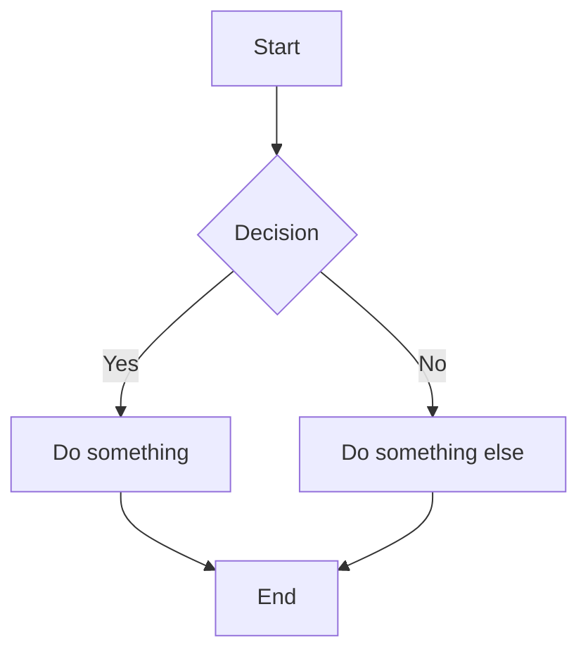

# mdnest User Guide

mdnest is a privately-hosted markdown notes app. Your notes are plain `.md` files on disk, and mdnest provides a clean web interface to browse, edit, and organize them. It works for personal use (single-user mode) or team collaboration (multi-user mode).

---

## Getting Started

### Logging In

Open mdnest in your browser (e.g., `http://localhost:3236`). You will see a login screen. In single-user mode, enter the username and password from your configuration (`MDNEST_USER` and `MDNEST_PASSWORD`). In multi-user mode, use the credentials provided by your admin.

After a successful login, the session lasts 24 hours before you need to log in again.

### Your First Note

1. In the sidebar, select a namespace (the dropdown at the top).
2. Click the **New Note** button in the toolbar.
3. Enter a filename (e.g., `hello.md`).
4. Start typing in the editor. Your changes are saved when you stop editing.

---

## The Sidebar

The left sidebar contains two key elements:

### Namespace Selector

The dropdown at the top of the sidebar lists all configured namespaces. Each namespace corresponds to a separate directory on the host machine. Select a namespace to browse its file tree.

### Folder Tree

Below the namespace selector, the folder tree shows all files and folders in the selected namespace. Folders appear before files, and both are sorted alphabetically.

- Click a **folder** to expand or collapse it.
- Click a **file** to open it in the editor.
- Hidden files (those starting with `.`) are not shown. This keeps `.git` directories and other dotfiles out of the way.

On mobile, tap the hamburger menu icon in the top-left corner to show or hide the sidebar.

---

## Creating Notes and Folders

There are two ways to create notes and folders.

### Toolbar Buttons

At the top of the sidebar:

- **New Note** -- creates a new markdown file. You will be prompted for a filename. The file is created inside whichever folder is currently selected (or the root if none is selected).
- **New Folder** -- creates a new folder. You will be prompted for a name.

### Context Menu

Right-click (desktop) or long-press (mobile) on any folder in the tree to open a context menu with options to:

- Create a new note inside that folder
- Create a new subfolder
- Rename the folder
- Delete the folder and its contents

Right-click or long-press on a file to:

- Rename the file
- Delete the file

---

## Editing

### Editor Modes

mdnest has two editing modes, switchable from the toolbar when in editor-only view:

**Basic Mode** (default) -- a plain-text area where you write raw markdown. Simple, fast, no rendering overhead. Includes a formatting toolbar for bold, italic, headings, links, code, lists, and checkboxes. Press **Tab** to indent.

**Live Mode** -- Obsidian-style rich editing powered by Milkdown. Markdown renders inline as you type:

- Type `**bold**` and it renders **bold** immediately
- Type `## Heading` and it renders as a heading
- Tables are click-to-edit -- click any cell, tab between cells
- Checkboxes are clickable
- Mermaid diagrams render in-place with Source/Preview/Fullscreen/Copy/Zoom buttons
- Click any mermaid node label to edit it directly on the diagram
- Paste from Google Docs or Confluence -- auto-converts to markdown
- Full formatting toolbar: Bold, Italic, Strikethrough, Code, Headings, Lists, Blockquote, Link, Code block, Table with row/column controls

Live Mode is only available in editor-only view (the pen icon). Split view always uses Basic Mode with a separate preview pane.

Changes are saved automatically in both modes. There is no manual save button -- your edits are sent to the backend as you type.

---

## Live Preview

The preview pane renders your markdown in real time as you type. The following elements are supported:

- Standard markdown: headings, bold, italic, links, images, blockquotes, code blocks, tables, horizontal rules
- Fenced code blocks with syntax highlighting
- Mermaid diagrams
- Task checkboxes
- Inline and referenced images (including uploaded images)

### Editor and Preview Layout

On desktop, the editor and preview appear side by side.

On mobile, you toggle between editor and preview views since there is not enough screen space for both.

---

## Mermaid Diagrams

mdnest renders [Mermaid](https://mermaid.js.org/) diagrams inside fenced code blocks tagged with `mermaid`.

**Syntax:**

````markdown

````

This renders as an interactive diagram in the preview pane. Mermaid supports many diagram types including flowcharts, sequence diagrams, Gantt charts, class diagrams, and more. Refer to the [Mermaid documentation](https://mermaid.js.org/intro/) for the full syntax reference.

---

## Inline Comments

> **Requires multi-user mode with live collaboration enabled** (`AUTH_MODE=multi` and `ENABLE_LIVE_COLLAB=true`). Each comment is tied to a real user account and relies on the WebSocket hub. In single-user mode or when live collab is off the comment UI is hidden.

Leave feedback on any part of a note without touching its content.

### Adding a comment

1. Open a note in **Live** editor mode.
2. Select the text you want to comment on. A small **💬 Comment** button appears next to the selection.
3. Click it — the comment panel slides out on the right with the quoted text above the reply box.
4. Type your message and press **Enter** (use **Shift+Enter** for a newline). The selected text is now highlighted in bright yellow inside the editor.

You can also open the panel without a selection via the speech-bubble icon in the toolbar and leave a general note-level comment.

### Yellow highlights

Every active comment anchor stays highlighted in the editor while you browse the note — you see at a glance which passages have been discussed. Highlights are transparent in the browser print dialog and in PDF exports, so they never leak into shared or printed copies.

### Threaded replies

Click **Reply** on any open thread to continue the conversation under the main comment. Replies show in an indented box below the parent, share the parent's anchor, and stay grouped together. Press **Enter** to send, **Esc** to cancel.

### Jumping between comments and text

- **Click any yellow highlight** in the editor to open the sidebar and pulse the matching thread into view.
- Click **Go To** on any thread in the sidebar to scroll the editor to the commented text — the highlight briefly pulses so you can't miss it.

### Resolving, reopening, deleting

- **Resolve** collapses the thread into the "Resolved" section at the bottom of the sidebar. Resolved threads stop highlighting their text.
- **Reopen** brings a resolved thread back to active and restores its highlight.
- **Delete** is available to the comment's author and to admins. Soft-deleted comments are removed from the sidebar and the JSONL file keeps a `deletedAt` timestamp.

### Comments survive file moves

Every note carries an invisible `<!-- mdnest:<uuid> -->` marker at its bottom that's stripped on GET and re-injected on save. Comments are stored at `<namespace>/.mdnest/comments/<uuid>.jsonl`. Moving or renaming a file preserves the UUID inside the content, so its comment history follows it — no broken links.

---

## Task Checkboxes

Standard markdown task list syntax is supported:

```markdown
- [ ] Unchecked item
- [x] Checked item
```

In the preview pane, checkboxes are rendered as interactive elements. Clicking a checkbox toggles its state and updates the underlying markdown file automatically.

---

## Image Upload

mdnest supports uploading images directly into your notes.

### Paste from Clipboard

Copy an image to your clipboard (e.g., take a screenshot) and paste it into the editor. The image is uploaded automatically and a markdown image reference is inserted at the cursor position.

### Drag and Drop

Drag an image file from your file manager and drop it onto the editor. The image is uploaded and a reference is inserted.

Uploaded images are saved in the same directory as the current note. They are served through the `/api/files/` endpoint and rendered in the preview.

---

## Drag and Drop (Files and Folders)

You can reorganize your notes by dragging items in the sidebar tree.

- Drag a file onto a folder to move it into that folder.
- Drag a folder onto another folder to nest it.

The move happens within the same namespace. Cross-namespace moves are not supported.

---

## Context Menu

The context menu provides quick actions for files and folders in the sidebar.

| Platform | How to open |
|----------|-------------|
| Desktop | Right-click on a file or folder |
| Mobile | Long-press on a file or folder |

**Folder context menu options:**

- New Note -- create a note inside this folder
- New Folder -- create a subfolder
- Rename -- rename the folder
- Delete Folder -- remove the folder and all its contents

**File context menu options:**

- Rename -- rename the file
- Delete -- remove the file

**Toolbar actions** (appear when a file is open):

- Rename -- rename the current file
- Delete -- delete the current file (with confirmation)

---

## Mobile Usage

mdnest is designed to work on mobile browsers.

- **Sidebar toggle:** Tap the hamburger menu icon (top-left) to show or hide the sidebar.
- **Editor/Preview toggle:** On small screens, the editor and preview are shown one at a time. Use the toggle to switch between them.
- **Context menu:** Long-press on a file or folder to open the context menu (equivalent to right-click on desktop).

---

## Deep Links

The URL hash encodes the current namespace and file path. You can bookmark or share direct links to specific notes.

**Format:**

```
http://localhost:3236/#namespace/path/to/note.md
```

**Examples:**

```
http://localhost:3236/#personal/todo.md
http://localhost:3236/#work/projects/roadmap.md
```

Opening a deep link takes you directly to that note (after login if your session has expired).

---

## Version Updates

When the server is updated to a new version, active browser sessions will see a blue banner at the top:

> **New version available: v3.1.0 → v3.2.0** [Refresh Now]

Click "Refresh Now" to reload and pick up the latest frontend. The check runs every 60 seconds.

## Per-File Preferences

mdnest remembers your preferences for each file individually:

- **View mode** — editor, split, or preview. Switch once and it sticks for that file.
- **Editor mode** — basic (textarea) or live (rich editor). New files default to Live mode.
- **Scroll position** — where you left off. Switch between files and come back to the same spot.

Preferences are stored in your browser's local storage and survive page refreshes.

## Keyboard Shortcuts

| Key | Action |
|-----|--------|
| Tab | Indent the current line in the editor |
