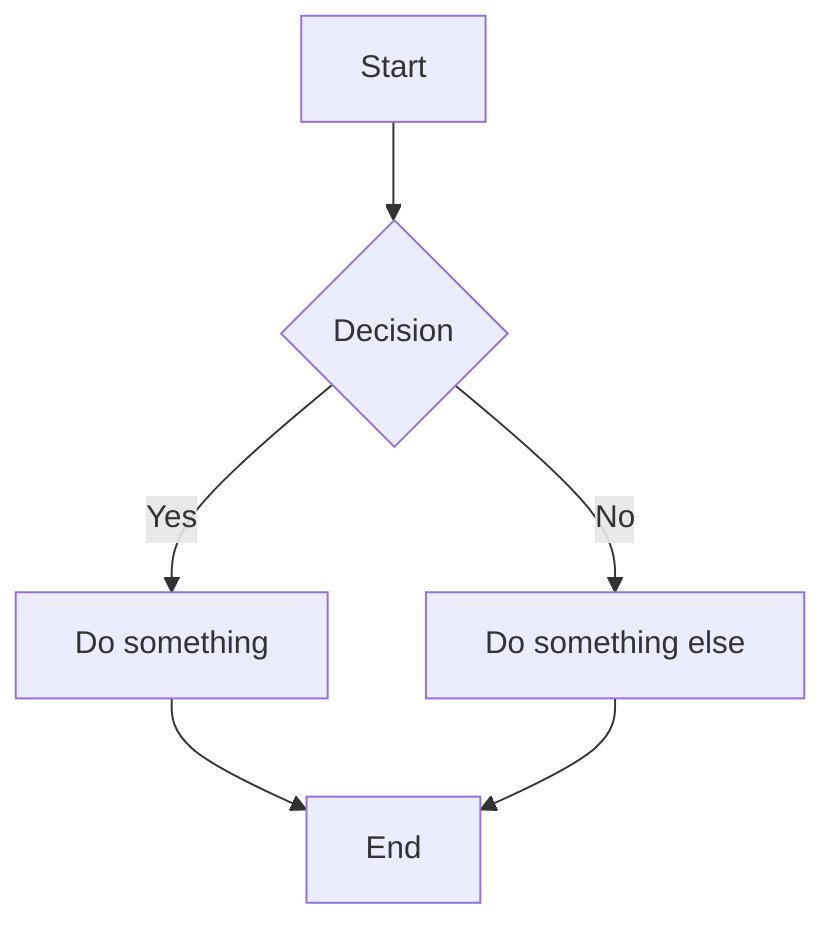

# mdnest User Guide

mdnest is a privately-hosted markdown notes app. Your notes are plain `.md` files on disk, and mdnest provides a clean web interface to browse, edit, and organize them. It works for personal use (single-user mode) or team collaboration (multi-user mode with role-based access, namespace-scoped admins, and corporate SSO), and scales up to an organization-wide, active/active deployment on Kubernetes (see [kubernetes.md](kubernetes.md)).

If you're an end-user being added to your team's mdnest, read **Logging In** and **The Sidebar** below — that's enough to get going. The rest is reference. If you also have admin scope, see **Roles & administration** further down.

---

## Getting Started

### Logging In

Open mdnest in your browser (your admin will give you the URL). The login screen adapts to how the server is configured:

- **Multi-user mode with SSO** *(typical team install)*: a single **Sign in with \<provider\>** button (Google, Okta, Microsoft Entra, etc.). Click it, complete the IdP flow on the IdP's page, and you're back in mdnest. Your admin must have invited your corporate email first — otherwise you'll see "account is not authorized on this server" after the IdP round-trip.
- **Multi-user mode (local):** enter the credentials your admin provided. 2FA may be required on first sign-in or if your admin enabled `REQUIRE_2FA`.
- **Single-user mode** *(personal install)*: enter the username and password from `mdnest.conf`'s `MDNEST_USER` / `MDNEST_PASSWORD`.

A successful login gives you a 30-day session. The browser stores a JWT in `localStorage`; closing the tab doesn't sign you out, but clearing site data does.

After login your name and IdP profile picture appear at the bottom of the sidebar. The picture refreshes from the IdP on every sign-in (since profile-picture URLs at Google etc. rotate).

### Your First Note

1. In the sidebar, select a namespace (the dropdown at the top).
2. Click the **New Note** button in the toolbar.
3. Enter a filename (e.g., `hello.md`).
4. Start typing in the editor. Your changes are saved when you stop editing.

---

## The Sidebar

The left sidebar contains two key elements:

### Namespace Selector

The dropdown at the top of the sidebar lists all configured namespaces. Each namespace corresponds to a separate directory on the host machine. Select a namespace to browse its file tree.

### Folder Tree

Below the namespace selector, the folder tree shows all files and folders in the selected namespace. Folders appear before files, and both are sorted alphabetically.

- Click a **folder** to expand or collapse it.
- Click a **file** to open it in the editor.
- Hidden files (those starting with `.`) are not shown. This keeps `.git` directories and other dotfiles out of the way.
- **The tree remembers which folders you had open, per namespace** (v3.11.4+). A refresh or namespace switch restores your expanded folders instead of re-expanding everything; the folder holding the currently-open file auto-reveals but can still be collapsed.

On mobile, tap the hamburger menu icon in the top-left corner to show or hide the sidebar.

---

## Roles & administration (multi-user mode)

mdnest has three user roles. Most teammates are collaborators — only people who manage the install or a specific team's namespace get an admin role.

| Role | Scope | What they can do |
|---|---|---|
| **Super-admin** | Global | Manage every user, every namespace, every grant. Promote / demote between roles, reset 2FA, delete users, sync any namespace. There must always be at least one super-admin. |
| **Admin** | Per-namespace (one or more) | Within their namespaces only — invite teammates, create / edit / revoke grants, promote co-admins, trigger git-sync. Implicit read+write on those namespaces. **Cannot** reset 2FA, delete users, or change global roles. |
| **Collaborator** | Per-grant only | Read or write only on the specific namespaces / paths the admin has granted them. No admin panel button. |

Where each role comes from:

- **Super-admin** is set in `mdnest.conf` via `ADMIN_EMAILS=ops@example.com,you@example.com` (auto-promoted on every server startup), or by another super-admin via the admin panel's role dropdown.
- **Admin** is *namespace-scoped* — assigned per namespace. Open the admin panel → **Namespace Admins** tab → pick a namespace → pick a user → **Make admin of `<namespace>`**. The promotion auto-grants the user `write` access on `/` of that namespace and bumps their `users.role` from `collaborator` to `admin`.
- **Collaborator** is the default for newly-invited users. They get explicit `access_grants` rows for the namespaces / paths the inviting admin scoped them to.

If you can see the **Admin** button in the top-right of the app, you have at least namespace-admin scope. The admin panel shows your scope as a yellow `Admin of: <namespace list>` badge so you know what you're managing. Super-admins see "Admin of: (none)" and full reign over everything.

### Inviting a user

Open the admin panel → **Users** tab → **+ Invite User**. Fill in the form:

- **Email** — required. In SSO / Firebase mode this is also the IdP login key; in local mode it's just an identifier.
- **Username + password** — *only shown in local mode.* In SSO and Firebase mode, identity comes from the IdP and the form is email-only (the panel also displays a one-line note explaining this).
- **Role** — Collaborator by default. Admins can also invite as **Admin (of this namespace)**. Super-admins additionally have **Super-admin (global)**.
- **Namespace** — required when you're a namespace-admin (you can only invite into namespaces you administer). Optional for super-admins (they can grant access later via the **Access Grants** tab).

The invited user can sign in immediately — no email confirmation is sent. Tell them the URL and they're in.

### Resetting a forgotten password *(v3.6.0+, local provider only)*

A user forgot their password? Two paths, depending on what role they hold and who's doing the reset:

**From the Admin Panel** (super-admins, for collaborators and namespace-admins):

1. Open the admin panel → **Users** tab.
2. Find the user. Click **Reset password**.
3. Type a temporary password twice. Send it over a secure channel (Slack DM, password manager — not email).
4. The user logs in with the temp password and is immediately forced to pick their own. The temp password becomes single-use; nothing else in the app is reachable until they change it.

The button is hidden for super-admin rows on purpose — see below.

**From the host shell** (super-admins resetting another super-admin, or any case where you don't want a UI round-trip):

```bash
./mdnest-server reset-password user@example.com
```

Prompts twice with hidden input, pipes the password into the backend container via stdin (so it never appears in `ps`, your shell history, or process arguments). The same forced-change flow applies on next login. Works for any user role, including super-admins.

**Why super-admins can't reset other super-admins from the UI:** if any super-admin can change any other super-admin's password from the web app, one compromised super-admin account is enough to lock out every other super-admin. The host CLI gates the same operation behind shell access to the server — a much higher bar — so the legitimate "my colleague forgot their super-admin password" case is still a one-line fix, while a compromised web session can't escalate.

This whole feature is local-provider only. In Firebase / SSO mode the IdP owns the password — reset it there.

---

## Creating Notes and Folders

There are two ways to create notes and folders.

### Toolbar Buttons

At the top of the sidebar:

- **+ Folder** -- creates a new folder. You will be prompted for a name.
- **+ Note** -- creates a new markdown file. You will be prompted for a filename.
- **+ Drawing** -- creates a new `.excalidraw.md` drawing (when drawings are enabled).

**Where new items are created** *(clarified in v4.2.1)*: click a folder in the
tree to aim these buttons at it — the folder is highlighted, and each button's
tooltip names the destination. Click the **root** row at the top of the tree to
aim them back at the top level. With nothing selected they follow the folder of
the note you have open, falling back to the workspace root. Creating from a
folder's right-click menu always targets that folder, regardless of what is
selected.

### Context Menu

Right-click (desktop) or long-press (mobile) on any folder in the tree to open a context menu with options to:

- Create a new note inside that folder
- Create a new subfolder
- Rename the folder
- **Move to…** -- pick a destination folder from a touch-friendly list (added v3.8.0). Useful on mobile, where HTML5 drag-and-drop is disabled.
- Delete the folder and its contents

Right-click or long-press on a file to:

- Rename the file -- if you don't type an extension, the original one is preserved (so renaming `notes.md` to `summary` becomes `summary.md`).
- **Move to…** -- pick a destination folder (added v3.8.0). Same picker as the folder context menu.
- Delete the file

---

## Editing

### Editor Modes

mdnest has two editing modes, switchable from the toolbar when in editor-only view:

**Basic Mode** (default) -- a plain-text area where you write raw markdown. Simple, fast, no rendering overhead. Includes a formatting toolbar for bold, italic, headings, links, code, lists, and checkboxes. Press **Tab** to indent.

**Live Mode** -- Obsidian-style rich editing built on [Crepe](https://milkdown.dev/playground) (the same editor Milkdown's official playground uses). Markdown renders inline as you type:

- Type `**bold**` and it renders **bold** immediately
- Type `## Heading` and it renders as a heading
- Tables are click-to-edit -- single click any cell to start typing, tab between cells
- Checkboxes are clickable (native SVG icons)
- Mermaid diagrams render in-place with Source/Preview/Fullscreen/Copy/Zoom buttons; pasting raw mermaid source auto-wraps it in a ```mermaid` fence
- Click any mermaid node label to edit it directly on the diagram
- Paste from Google Docs or Confluence -- auto-converts to markdown
- Full formatting toolbar: Undo, Redo, Bold, Italic, Strikethrough, Code, Headings, Lists, Blockquote, Link, Code block, Table with row/column controls
- **Undo / Redo** *(v3.6.1+)*: the curved-arrow buttons at the start of the toolbar. Same as `Cmd+Z` / `Cmd+Shift+Z` (or `Ctrl+Z` / `Ctrl+Shift+Z`) on the keyboard. macOS uses `Cmd+Shift+Z` for redo, not `Cmd+Y`.
- **Block-edit menu** *(v3.10.0+)*: hover the left margin of any block for a drag-handle + `+` insert button. The `+` button (or typing `/` anywhere) opens a slash menu with Heading 1-6, Code block, Math, Image, Horizontal rule, Table, and more.
- **Block-handle toggle** *(v3.11.0+)*: the grip button at the start of the toolbar hides the left drag/`+` handle so content uses the full width — handy on mobile (where it's hidden by default). Typing `/` still opens the slash menu with the handle hidden. The choice is remembered per browser.
- **Inline + block math** *(v3.10.0+)*: `$inline$` and `$$block$$` render via KaTeX.
- **Image upload** *(v3.10.0+)*: insert an image block from the slash menu and click "Upload" — or just paste an image from the clipboard. Uploads land next to the current note.
- **Last-opened file remembered per workspace** *(v3.10.0+)*: switching workspaces and switching back restores whichever file you had open in that workspace, with its scroll position. Bookmark a URL with `#namespace/path/to/note.md` to override.

Live Mode is only available in editor-only view (the pen icon). Split view always uses Basic Mode with a separate preview pane.

**Board / Editor** — the first button in the toolbar swaps to name where it takes you: on a note it says **Board** and opens the [task board](#task-board) for the whole workspace; on the board it says **Editor** and brings you back. The Basic · Live switch beside it decides *how you edit* the note, so it disappears while the board is open — there is no note on screen for it to act on.

Changes are saved automatically in both modes. There is no manual save button -- your edits are sent to the backend as you type. As of v3.6.1, autosave will refuse to truncate a non-empty note to empty (a defensive guard against editor bugs that could otherwise wipe content); to deliberately empty a file, delete it via right-click → Delete.

---

## Recovering lost content

If you lose content -- accidental delete, a stuck undo, fat-fingered overwrite -- there are three recovery paths depending on whether you've enabled the optional **git-sync** sidecar.

### In-app History (v3.7.0+, fastest)

Right-click any note → **History**. A modal opens listing the most recent 50 git-sync commits affecting that file, newest first. Click any commit to preview its content, then click **Restore this version** to write that older content back. The restoration itself goes through the regular save path, so it's also versioned -- if you restore to the wrong commit, the History modal can take you back.

If git-sync isn't configured for the namespace, the modal tells you so and points at the setup hint. In multi-user installs, if other people are currently viewing the same file, the modal warns you and asks for confirmation before restoring; they see an info banner explaining what happened so it's not a silent surprise.

### With git-sync (manual, via the git remote)

If `git-sync/keys/` has any SSH key, every namespace is being auto-committed to the corresponding git remote on a regular cadence (default 600s -- tunable via `GIT_SYNC_INTERVAL` in `mdnest.conf`). Every change you've made is in commit history. You haven't lost it.

**Recover via the git remote (e.g. GitHub):**

1. Open the namespace's git repo (e.g. `https://github.com/<you>/<namespace>/commits/main`).
2. Find a `sync: <UTC-timestamp>` commit *before* the loss. Click into it.
3. Browse to the file. Click **Raw** or use the file viewer to see the old content.
4. Copy the content back into the mdnest editor and save -- it'll be picked up by the next sync cycle and re-committed alongside the original history.

**Recover via shell (if you have access to the host):**

```bash
# List recent sync commits with timestamps
docker exec mdnest-git-sync-1 sh -c 'cd /data/notes/<namespace> && git log --oneline -30'

# View the file at a specific commit
docker exec mdnest-git-sync-1 sh -c 'cd /data/notes/<namespace> && git show <commit-hash>:path/to/note.md'

# Or restore the whole file in place (will be saved + re-synced)
docker exec mdnest-git-sync-1 sh -c 'cd /data/notes/<namespace> && git checkout <commit-hash> -- path/to/note.md'
```

The recovery gap is at most one git-sync cycle (default 10 minutes; lower the cycle in `mdnest.conf` if recovery latency matters more to you than commit volume).

### Without git-sync

If `git-sync/keys/` is empty, no remote backup exists. Recovery options narrow:

- macOS Time Machine, ZFS snapshots, or any host-level filesystem snapshotting.
- An external mdnest CLI write history (if you used `mdnest write` -- the file at the time of write is in your shell history).
- Otherwise, the content is gone from mdnest's data layer.

**Strong recommendation:** if you keep anything important in mdnest, enable git-sync. It's the difference between "10 minutes of edits at risk" and "everything since the last good copy is gone."

For the common case, the in-app History modal (v3.7.0+) handles it without leaving mdnest -- the manual paths above are still useful for renamed files, bulk recoveries, or restoring multiple files at once.

**Sync health indicator (v3.11.4+).** When git-sync is enabled, the sidebar shows its status. If the background sync ever breaks (a diverged history it can't fast-forward, a rejected push, an unreachable remote), you'll see a red ✕ with "Git sync broken" and the reason on hover — instead of a stale "Synced X ago" that hides the problem. Admins get a **Retry** button that runs a commit + pull + push immediately. The daemon also self-heals most divergence on its own each cycle.

---

## Live Preview

The preview pane renders your markdown in real time as you type. The following elements are supported:

- Standard markdown: headings, bold, italic, links, images, blockquotes, code blocks, tables, horizontal rules
- Fenced code blocks with syntax highlighting
- Mermaid diagrams
- Task checkboxes
- Inline and referenced images (including uploaded images)

### Editor and Preview Layout

On desktop, the editor and preview appear side by side.

On mobile, you toggle between editor and preview views since there is not enough screen space for both.

---

## Wikilinks and internal links *(v3.11.5+)*

mdnest understands Obsidian-style `[[wikilinks]]`, so vaults imported from Obsidian keep their internal links working.

**Supported forms:**

| You write | It links to |
|---|---|
| `[[Meeting Notes]]` | the note `Meeting Notes.md` |
| `[[projects/Roadmap]]` | a note by path (the `.md` is optional) |
| `[[Roadmap\|the plan]]` | the same note, shown as *the plan* |
| `[[Setup#Install]]` | the *Install* heading inside `Setup.md` |
| `[[#Install]]` | the *Install* heading in the **current** note |

In the preview, a resolved wikilink is a highlighted internal link — clicking it opens the target note in place (no page reload), while middle-click and Ctrl/Cmd+Click open it in a new tab. A `[[#heading]]` link just scrolls to that heading. If the target note doesn't exist, the link renders muted and dashed so you can tell it's broken.

**How targets resolve:** an exact path first (with or without `.md`), then a case-insensitive match on the note's name; if two notes share a name, the one with the shortest path wins — the same rules Obsidian uses.

Ordinary relative markdown links to `.md` files — `[the roadmap](../projects/Roadmap.md)` — also navigate inside the app now, instead of opening a dead link in a new tab.

**In the Live editor**, `[[...]]` spans are highlighted; **Ctrl/Cmd+Click** opens the target (a plain click just places the cursor so you can edit). The stored file is never rewritten — the markdown on disk stays exactly `[[...]]`. Wikilinks inside inline code (`` `[[x]]` ``) or fenced code blocks are left as literal text, not links.

---

## Mermaid Diagrams

mdnest renders [Mermaid](https://mermaid.js.org/) diagrams inside fenced code blocks tagged with `mermaid`.

**Syntax:**

````markdown

```mermaid
graph TD
    A[Start] --> B{Decision}
    B -->|Yes| C[Do something]
    B -->|No| D[Do something else]
    C --> E[End]
    D --> E
```
````

This renders as an interactive diagram in the preview pane. Mermaid supports many diagram types including flowcharts, sequence diagrams, Gantt charts, class diagrams, and more. Refer to the [Mermaid documentation](https://mermaid.js.org/intro/) for the full syntax reference.

### Getting the text back out

A rendered diagram's labels are still text, and you can take them with you
(v4.1.3+):

- **Select them.** Drag across a label in the preview or in the fullscreen
  viewer. In fullscreen, a drag that *starts* on a label selects it; a drag
  starting anywhere else still pans the diagram.
- **Copy all of it.** Hover a diagram and click **Copy text** (next to the
  expand button), or use the **Copy text** button in the fullscreen viewer's
  toolbar. Every label lands on the clipboard, one per line, in diagram order —
  faster than selecting by hand on a zoomed or panned diagram.

---

## Live Collaboration

> **Requires multi-user mode with `ENABLE_LIVE_COLLAB=true`** in `mdnest.conf`.

When live collab is on, mdnest opens a WebSocket from your browser to the backend on sign-in. While that connection is open, the app fans real-time events between everyone editing in the same namespace:

- **Presence.** A small avatar stack at the top of the editor shows who else has the same note open right now. Tooltips reveal usernames.
- **Cursors.** When a teammate is editing the same note in **Live** mode, you see their cursor as a thin coloured caret with their name on it. Cursor positions update in real time.
- **Typing indicator.** When someone is actively typing, their avatar in the presence stack pulses faintly so you know to expect changes.
- **Conflict banner.** If two people save the same note within the auto-save window, the second save shows a "your edit is based on a stale copy" banner with a one-click reload. This rarely fires — the cursor sharing usually keeps people out of each other's way.
- **Tree refresh.** When someone else creates / renames / deletes a file in your namespace, your sidebar updates within a second without a manual refresh. This covers changes made *through mdnest*; a write that lands straight on the filesystem (a git-sync pull, an editor on the host) sends no event, and is picked up by the sidebar's own 30-second refresh instead — that refresh runs whether or not live collab is on.

Live collab is gated on the WebSocket hub being up. If `/api/ws` is unreachable (server restart, proxy hiccup), the editor still works — you just lose the presence + cursor + auto-tree-refresh features until the connection reconnects (the app retries with backoff).

In single-user mode or when `ENABLE_LIVE_COLLAB=false`, none of this loads — there's nothing to collaborate on.

---

## Inline Comments

> **Requires multi-user mode with live collaboration enabled** (`AUTH_MODE=multi` and `ENABLE_LIVE_COLLAB=true`). Each comment is tied to a real user account and relies on the WebSocket hub. In single-user mode or when live collab is off the comment UI is hidden.

Leave feedback on any part of a note without touching its content.

### Adding a comment

1. Open a note in **Live** editor mode.
2. Select the text you want to comment on. A small **💬 Comment** button appears next to the selection.
3. Click it — the comment panel slides out on the right with the quoted text above the reply box.
4. Type your message and press **Enter** (use **Shift+Enter** for a newline). The selected text is now highlighted in bright yellow inside the editor.

You can also open the panel without a selection via the speech-bubble icon in the toolbar and leave a general note-level comment.

### Yellow highlights

Every active comment anchor stays highlighted in the editor while you browse the note — you see at a glance which passages have been discussed. Highlights are transparent in the browser print dialog and in PDF exports, so they never leak into shared or printed copies.

### Threaded replies

Click **Reply** on any open thread to continue the conversation under the main comment. Replies show in an indented box below the parent, share the parent's anchor, and stay grouped together. Press **Enter** to send, **Esc** to cancel.

### Jumping between comments and text

- **Click any yellow highlight** in the editor to open the sidebar and pulse the matching thread into view.
- Click **Go To** on any thread in the sidebar to scroll the editor to the commented text — the highlight briefly pulses so you can't miss it.

### Resolving, reopening, deleting

- **Resolve** collapses the thread into the "Resolved" section at the bottom of the sidebar. Resolved threads stop highlighting their text.
- **Reopen** brings a resolved thread back to active and restores its highlight.
- **Delete** is available to the comment's author and to admins. Soft-deleted comments are removed from the sidebar and the JSONL file keeps a `deletedAt` timestamp.

### Comments survive file moves

Every note carries an invisible `<!-- mdnest:<uuid> -->` marker at its bottom that's stripped on GET and re-injected on save. Comments are stored at `<namespace>/.mdnest/comments/<uuid>.jsonl`. Moving or renaming a file preserves the UUID inside the content, so its comment history follows it — no broken links.

---

## Task Checkboxes

Standard markdown task list syntax is supported:

```markdown
- [ ] Unchecked item
- [x] Checked item
```

In the preview pane and Live editor, checkboxes are interactive -- clicking one toggles its state and updates the underlying markdown file automatically.

Checkboxes are also the atoms of the **[Task Board](#task-board)**: any checkbox is a task, and a task can be enriched with a due date, priority, tags, sub-steps and a description written as an indented block underneath it. The full on-disk format is specified in **[Task Model](tasks.md)**.

---

## Task Board

> Slides: a note whose frontmatter declares `marp: true` renders as a
> [Marp](https://marp.app/) slide deck in the Preview pane — the same note you
> drafted the idea in is the deck you present from. Also opt-in
> (`ENABLE_MARP=true`); notes without `marp: true` are unaffected.

> Drawings: a `.excalidraw.md` note opens on a full Excalidraw canvas, and any
> note can embed one read-only with ``. Opt-in
> (`ENABLE_EXCALIDRAW=true`); see [Excalidraw](excalidraw.md).
>
> A drawing is still a markdown file, so the toolbar offers **Basic · Drawing**
> *(v4.2.1+)*: **Drawing** is the canvas, **Basic** shows the markdown behind it
> (the scene JSON plus the mirrored text elements). Live is deliberately not
> offered for drawings — the rich editor would reformat the scene and corrupt
> it, the same reason Marp decks are edited as raw text. Drawings open in dark
> mode to match the app, with a light/dark toggle in the canvas footer; that
> choice is per browser and is never written into the note, so the file stays
> portable and two people can view one drawing differently.

> Opt-in: the board appears only when the operator sets `ENABLE_TASK_BOARD=true`
> (see [setup](setup.md)). If you don't see the board button, that's why.

The task board gathers every task-list item in a namespace and presents it as a kanban board or a flat list. Because tasks live in your notes, the board is just a view of them -- editing on the board edits the note, and editing the note updates the board.

**Opening it.** Click **Board** in the toolbar. The board replaces the editor pane (the sidebar and header stay put) and is scoped to the current namespace.

**Getting back.** Either works: the same button now reads **Editor**, or use the back button at the start of the board's own header, which names the note you came from (**← my-note.md**).

**Lots of columns.** The board scrolls horizontally when the columns don't fit, so a wide board stays reachable on a narrow window.

**Lots of tasks.** A column shows 100 cards at a time with a **Show more** button; the number beside the column name is always the true total. On a big board the **Sort** control matters, because it decides which cards are on that first page: leave it on *Note order* to see tasks in the order they appear in your notes, or switch to *Due date, then priority* to bring the urgent ones to the front. Your choice is remembered.

**Views.**

- **Kanban / List** -- a toggle at the top left. Kanban shows one column per board column (drag a card between columns to change its status); List shows tasks grouped by note with quick checkboxes.
- **Workspace / This note / All workspaces** -- when a note is open, scope the board to the whole namespace, just the current note, or *(v4.2.0+)* every workspace you can access. In the cross-workspace view each card shows which workspace it came from; creating tasks and editing columns are hidden there, since both belong to one specific workspace.

**Filtering** *(v4.2.0+).* A filter bar narrows the loaded tasks by title text, tags (click chips to toggle; matching is OR) and assignee (**All / Me / Unassigned / a member**). It applies to every scope and both views, and filters before grouping, so it's instant with no extra round-trip.

**Assignees** *(v4.2.0+).* A task can carry an `assignee`, picked from the workspace's members in the task editor. New tasks default to you. In single mode, where there's no member list, it's a free-choice field.

**Relations** *(v4.2.0+).* A task can declare `depends-on`, `blocked-by` and `related-to` links to other tasks, shown on the card and resolved by each task's stable `ref`.

**Sub-tasks gate closing** *(v4.2.0+).* A task with unresolved sub-steps can't be closed — checking it done, dragging it to a Done column, and saving an edit into one are all refused, with the reason shown. Tick the remaining steps first. This is enforced by the server, so it holds however you reach it.

**Cards.** Each card shows the title, a priority badge, the due date (red when overdue), tags, workload and a step progress bar. **More** expands the steps (tick them off individually) and the description.

**Creating a task.** Click **+ New task** to open the editor: title, target note (defaults to the board's default note), column, due date, priority, workload, tags, steps and a description. The task is appended to the chosen note (created if it doesn't exist).

**Editing a task.** Click **✎ edit** on any card or list row to open the same editor pre-filled; saving rewrites the whole task in its note.

**Columns & default note.** **Columns…** opens *Board settings*, where you name the columns, set the status value each one writes, mark the *Done* column, and choose the **default note** for new tasks. This is stored per namespace in `.mdnest/board.json`.

See **[Task Model](tasks.md)** for the exact markdown a task compiles to, and the [API Reference](api.md#task-board) for the endpoints.

---

## Image Upload

mdnest supports uploading images directly into your notes.

### Paste from Clipboard

Copy an image to your clipboard (e.g., take a screenshot) and paste it into the editor. The image is uploaded automatically and a markdown image reference is inserted at the cursor position.

### Drag and Drop

Drag an image file from your file manager and drop it onto the editor. The image is uploaded and a reference is inserted.

Uploaded images are saved in the same directory as the current note. They are served through the `/api/files/` endpoint and rendered in the preview.

---

## Drag and Drop (Files and Folders)

You can reorganize your notes by dragging items in the sidebar tree.

- Drag a file onto a folder to move it into that folder.
- Drag a folder onto another folder to nest it.
- Drop onto an **open folder's contents** — the space below its rows, or one of
  the files inside it — to move the item into that folder *(v4.2.1+)*.
- Drop onto the **root** row at the top of the tree to move an item back to the
  top level *(v4.2.1+)*.

The move happens within the same namespace. Cross-namespace moves are not supported.

---

## Context Menu

The context menu provides quick actions for files and folders in the sidebar.

| Platform | How to open |
|----------|-------------|
| Desktop | Right-click on a file or folder |
| Mobile | Long-press on a file or folder |

**Folder context menu options:**

- New Note -- create a note inside this folder
- New Folder -- create a subfolder
- Rename -- rename the folder
- Delete Folder -- remove the folder and all its contents

**File context menu options:**

- Rename -- rename the file
- Delete -- remove the file
- Attribution *(v4.2.0+, multi mode)* -- who created the note, who last edited it, and everyone who has contributed. Built from an activity trail of every save, cross-checked against the note's git history so edits made outside the app are still credited. Single-mode installs have no user identities to attribute, so the entry is hidden.

**Toolbar actions** (appear when a file is open):

- Rename -- rename the current file
- Delete -- delete the current file (with confirmation)

---

## Mobile Usage

mdnest is designed to work on mobile browsers.

- **Sidebar toggle:** Tap the hamburger menu icon (top-left) to show or hide the sidebar. The sidebar opens as a slide-over up to 420px wide so long names fit.
- **Editor/Preview toggle:** On small screens, the editor and preview are shown one at a time. Use the toggle to switch between them.
- **Context menu:** Long-press on a file or folder to open the context menu (equivalent to right-click on desktop).
- **Moving files:** Long-press → **Move to…** opens a destination picker. HTML5 drag-and-drop is disabled on touch (it interferes with scrolling), so this is the touch-friendly path for moves.
- **Show full names:** Tree labels ellipsize by default to keep the visual rhythm consistent. Tap the lines icon in the tree control bar to switch to wrap mode and read long file/folder names in full. The choice is remembered across visits.
- **Loading state:** A centered spinner shows while the tree loads on a slow connection; a thin animated bar appears at the top of the tree during a refresh so silence on the network never looks like an empty namespace.
- **Refresh tree:** A refresh icon sits in the tree-control row at the top of the sidebar. Tap it to reload the tree on demand. You shouldn't often need to — the tree re-reads itself every 30 seconds while the tab is visible, and again the moment you switch back to a backgrounded tab (v4.1.3+), which is what picks up files created outside the browser via the `mdnest` CLI, MCP, or a git-sync pull. That automatic refresh is deliberately silent: no spinner or progress bar for a reload you didn't ask for.
- **Toolbar path:** The currently-open file's basename always stays visible — only the parent path gets ellipsized when the toolbar is cramped.

---

## Deep Links

The URL hash encodes the current namespace and file path. You can bookmark or share direct links to specific notes.

**Format:**

```
http://localhost:3236/#namespace/path/to/note.md
```

**Examples:**

```
http://localhost:3236/#personal/todo.md
http://localhost:3236/#work/projects/roadmap.md
```

Opening a deep link takes you directly to that note (after login if your session has expired).

---

## Version Updates

When the server is updated to a new version, active browser sessions will see a blue banner at the top:

> **New version available: v3.1.0 → v3.2.0** [Refresh Now]

Click "Refresh Now" to reload and pick up the latest frontend. The check runs every 60 seconds.

## Appearance *(v4.3.0+)*

mdnest ships a light theme alongside the original dark one.

**Switching:** the sun/moon button in the top-right toolbar flips between light
and dark. The icon shows the theme you would switch *to*.

**Three choices, in Settings -> Appearance:**

| Choice | Behaviour |
|---|---|
| **Match system** | Follows your operating system's light/dark setting, and changes with it live -- no reload needed. |
| **Light** | Always light, whatever your system is set to. |
| **Dark** | Always dark. |

**Your choice follows you, not your browser.** It is stored against your account
on the server, so signing in on a phone, a different browser, or a fresh private
window gives you the theme you picked. (mdnest keeps a copy in local storage too,
but only so the first paint is the right colour instead of flashing -- the server
is what decides.)

**Before you choose**, mdnest uses the server's `DEFAULT_THEME` setting, which an
administrator can set in `mdnest.conf`; if that is `auto` (the default), it
follows your operating system.

**Drawings** follow the app theme, and repaint straight away when you change it.
The theme is never written into the drawing file, so an `.excalidraw.md` stays
portable and two people can view the same drawing in different themes.

**Slide decks keep their own theme.** A Marp deck is something you authored to
look a particular way, and it renders that way regardless of your app theme.

## Per-File Preferences

mdnest remembers your preferences for each file individually:

- **View mode** — editor, split, or preview. Switch once and it sticks for that file.
- **Editor mode** — basic (textarea) or live (rich editor). New files default to Live mode.
- **Scroll position** — where you left off. Switch between files and come back to the same spot.

These are per-file and per-browser: they live in local storage and survive page
refreshes, but do not follow you to another device. Your **theme** is different --
it is stored on the server against your account (see Appearance above).

## Keyboard Shortcuts

| Key | Action |
|-----|--------|
| Tab | Indent the current line in the editor |
